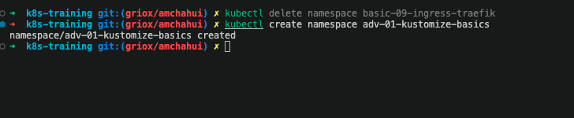
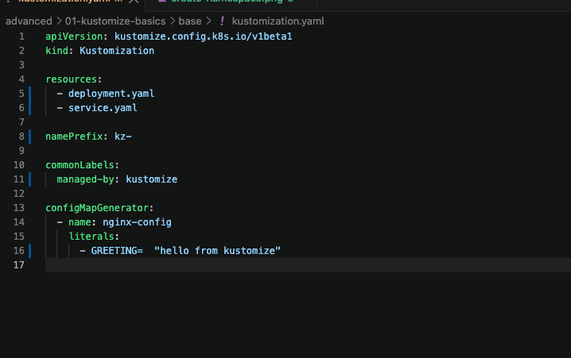
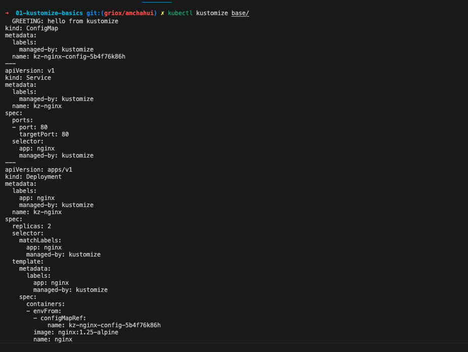
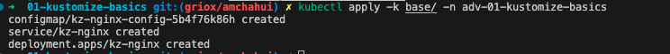
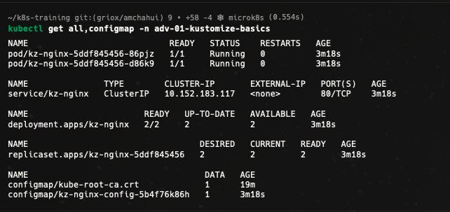
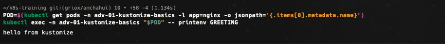
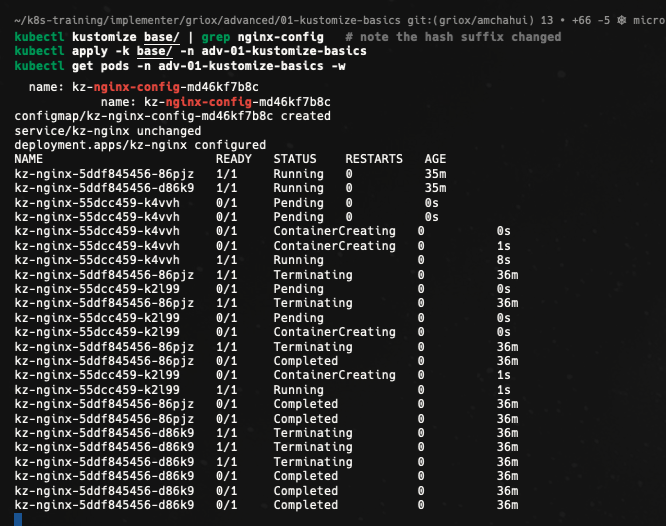
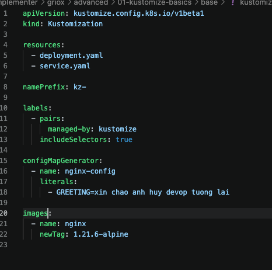
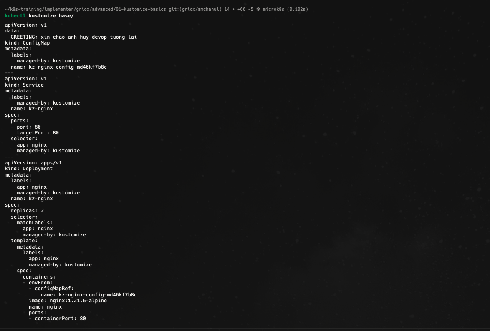

# Advanced 01 - Kustomize basics

Tài liệu này ghi lại quá trình em thực hiện bài [advanced/01-kustomize-basics/README.md](../../../../advanced/01-kustomize-basics/README.md). Mục tiêu của bài là dùng Kustomize để quản lý các manifest Kubernetes, preview output trước khi apply, sinh ConfigMap tự động và kiểm chứng rollout khi nội dung ConfigMap thay đổi.

## 1. Tạo namespace cho bài Kustomize

Đầu tiên em tạo namespace `adv-01-kustomize-basics` để cô lập các tài nguyên của bài thực hành. Namespace riêng giúp việc quan sát Deployment, Service, Pod và ConfigMap rõ ràng hơn, đồng thời dễ dọn dẹp sau khi hoàn tất bài lab.

Ảnh bằng chứng:

## 2. Cấu hình file kustomization

Tiếp theo em điền nội dung cho `base/kustomization.yaml`. File này khai báo hai manifest gốc là `deployment.yaml` và `service.yaml`, thêm prefix `kz-` vào tên tài nguyên, gắn label `managed-by: kustomize`, đồng thời sinh ConfigMap `nginx-config` với biến môi trường `GREETING`.

Ở bước đầu, ảnh chụp thể hiện cấu hình theo yêu cầu bài lab với `resources`, `namePrefix`, `commonLabels` và `configMapGenerator`.

Ảnh bằng chứng:

## 3. Preview manifest được render bởi Kustomize

Trước khi apply vào cluster, em chạy `kubectl kustomize base/` để xem toàn bộ manifest sau khi Kustomize xử lý. Output cho thấy ConfigMap được sinh với tên có hash, Service và Deployment đều được đổi tên thành `kz-nginx`, đồng thời label `managed-by: kustomize` được thêm vào các tài nguyên.

Ảnh bằng chứng:

## 4. Apply kustomization vào namespace

Sau khi kiểm tra output render, em apply toàn bộ cấu hình bằng `kubectl apply -k base/ -n adv-01-kustomize-basics`. Kết quả cho thấy ConfigMap, Service và Deployment đều được tạo thành công trong namespace của bài.

Ảnh bằng chứng:

## 5. Kiểm tra tài nguyên đã tạo trong namespace

Em dùng `kubectl get all,configmap -n adv-01-kustomize-basics` để xác nhận trạng thái sau khi apply. Kết quả cho thấy có 2 Pod của Deployment `kz-nginx` đang chạy, Service `kz-nginx` đã được tạo, Deployment có đủ 2 replica available và ConfigMap `kz-nginx-config-5b4f76k86h` tồn tại trong namespace.

Ảnh bằng chứng:

## 6. Xác nhận Pod nhận biến môi trường từ ConfigMap

Sau khi tài nguyên chạy ổn định, em lấy tên một Pod có label `app=nginx`, rồi exec vào Pod để in biến môi trường `GREETING`. Kết quả trả về `hello from kustomize`, chứng minh Deployment đã tham chiếu đúng ConfigMap được Kustomize sinh ra.

Ảnh bằng chứng:

## 7. Thay đổi nội dung ConfigMap và apply lại

Em chỉnh giá trị `GREETING` trong `base/kustomization.yaml`, sau đó render lại bằng Kustomize để quan sát hash của ConfigMap thay đổi. Khi apply lại, Kubernetes tạo ConfigMap mới `kz-nginx-config-md46kf7b8c`, Deployment được cấu hình lại và các Pod bắt đầu rolling update.

Ảnh chụp cũng thể hiện Pod cũ chuyển sang trạng thái `Terminating` hoặc `Completed`, trong khi Pod mới được tạo và chạy lại. Điều này chứng minh khi nội dung ConfigMap generator thay đổi, tên ConfigMap thay đổi theo hash và Deployment tự rollout vì Pod template reference đã đổi.

Ảnh bằng chứng:

## 8. Bonus challenge - Override image bằng Kustomize

Ở phần bonus, em thêm transformer `images` vào `base/kustomization.yaml` để override image `nginx` sang tag `1.21.6-alpine` mà không cần sửa trực tiếp `deployment.yaml`. Đồng thời file vẫn giữ phần sinh ConfigMap và label transformer.

Ảnh bằng chứng:

## 9. Bonus challenge - Kiểm tra output sau khi override image

Sau khi thêm `images`, em chạy lại `kubectl kustomize base/`. Output render cho thấy container `nginx` trong Deployment đã dùng image `nginx:1.21.6-alpine`, trong khi manifest gốc vẫn khai báo image cũ. Đây là cách Kustomize cho phép tùy biến image theo môi trường mà không phải chỉnh sửa trực tiếp file Deployment ban đầu.

Ảnh bằng chứng:

## Tổng kết

Qua bài này, em đã thực hành được các nội dung chính của Kustomize:

- Khai báo danh sách manifest gốc trong `resources`.
- Dùng `namePrefix` để đổi tên tài nguyên khi render.
- Gắn label chung cho tài nguyên và selector.
- Sinh ConfigMap bằng `configMapGenerator`.
- Preview manifest bằng `kubectl kustomize base/` trước khi apply.
- Apply toàn bộ cấu hình bằng `kubectl apply -k`.
- Xác nhận Pod nhận biến môi trường từ ConfigMap được sinh ra.
- Thay đổi nội dung ConfigMap để quan sát hash mới và rollout tự động.
- Dùng `images` transformer để override image tag mà không sửa `deployment.yaml`.

Kết quả bài lab giúp em hiểu rõ hơn cách Kustomize quản lý manifest theo hướng declarative, đặc biệt là khả năng biến đổi tên, label, ConfigMap và image một cách nhất quán trước khi tài nguyên được apply vào Kubernetes cluster.
