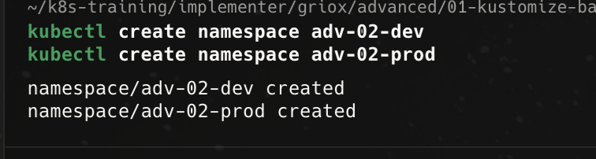
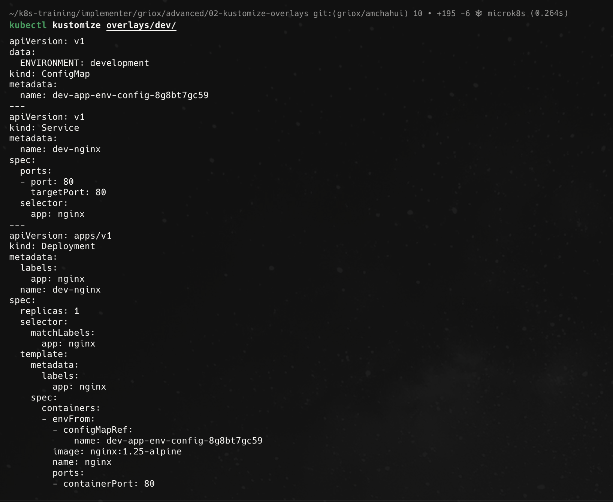
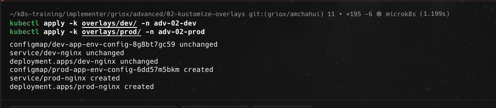
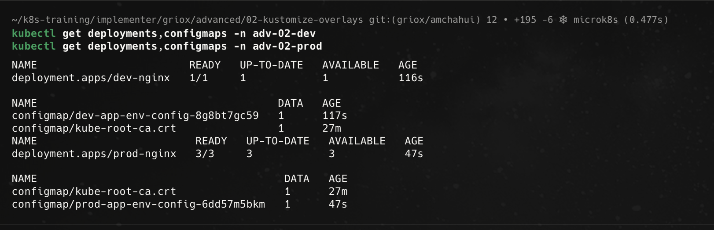
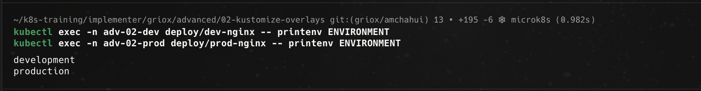
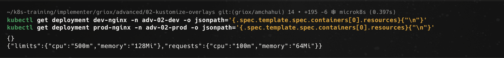
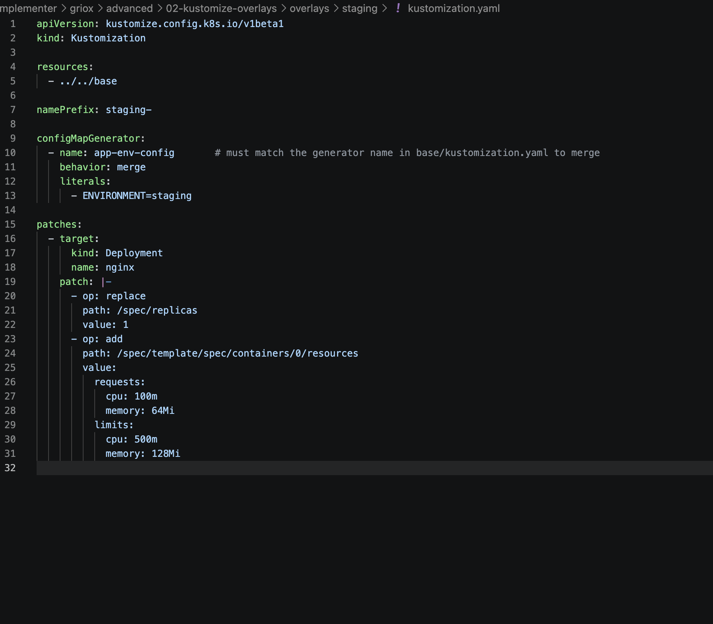
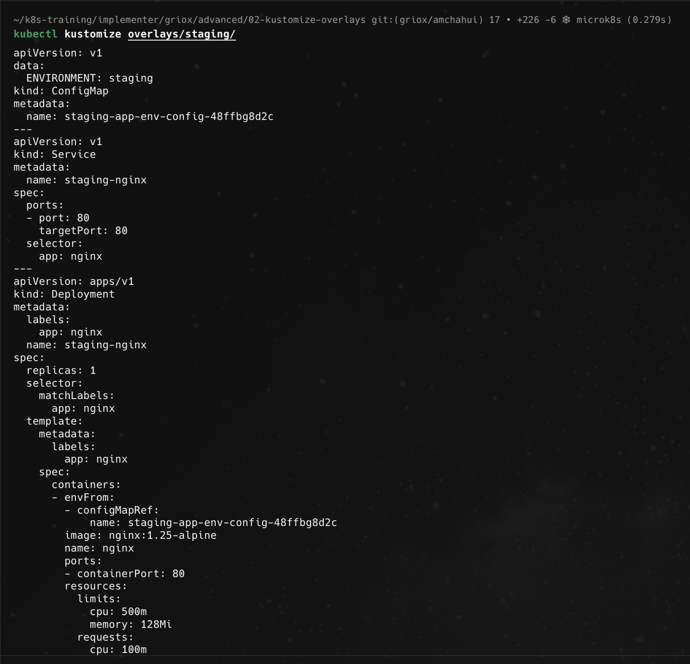
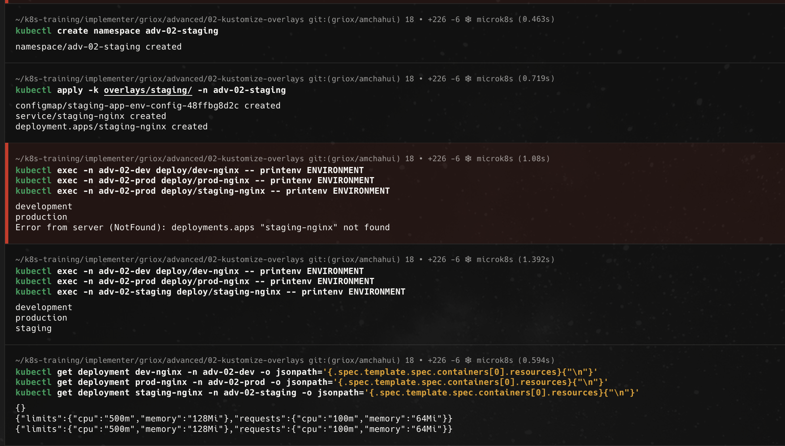

# Advanced 02 - Kustomize overlays

Tài liệu này ghi lại quá trình em thực hiện bài [advanced/02-kustomize-overlays/README.md](../../../../advanced/02-kustomize-overlays/README.md). Mục tiêu của bài là dùng Kustomize overlay để tách cấu hình theo từng môi trường như `dev`, `prod` và `staging`, trong khi vẫn dùng chung manifest nền trong `base/`.

## 1. Tạo namespace cho dev và prod

Đầu tiên em tạo hai namespace riêng là `adv-02-dev` và `adv-02-prod`. Việc tách namespace giúp chạy hai overlay song song trên cùng cluster mà không đè tên tài nguyên của nhau.

Ảnh bằng chứng:

## 2. Cấu hình base dùng chung

Trong thư mục `base/`, Kustomize quản lý `deployment.yaml` và `service.yaml`, đồng thời sinh ConfigMap `app-env-config` bằng `configMapGenerator`. Giá trị mặc định trong base là `ENVIRONMENT=base`, Deployment chạy 1 replica và container đọc biến môi trường thông qua `envFrom.configMapRef`.

Phần này là nền chung để các overlay kế thừa. Khi overlay trỏ về `../../base`, Kustomize sẽ lấy toàn bộ Deployment, Service và ConfigMap generator từ base trước, sau đó mới áp các thay đổi riêng của môi trường.

## 3. Cấu hình và preview dev overlay

Ở overlay `dev`, em cấu hình `resources` trỏ về `../../base`, thêm `namePrefix: dev-`, merge lại ConfigMap để đổi `ENVIRONMENT=development`, và patch Deployment để replica count là `1`.

Khi chạy `kubectl kustomize overlays/dev/`, output render cho thấy:

- ConfigMap có dữ liệu `ENVIRONMENT: development`.
- Tên tài nguyên được thêm prefix `dev-`, ví dụ `dev-nginx`.
- Deployment `dev-nginx` có `replicas: 1`.
- Container tham chiếu tới ConfigMap đã được Kustomize đổi sang tên có hash.

Ảnh bằng chứng:

## 4. Cấu hình prod overlay

Ở overlay `prod`, em cũng trỏ `resources` về `../../base`, nhưng dùng `namePrefix: prod-`, merge ConfigMap thành `ENVIRONMENT=production`, patch Deployment lên `replicas: 3`, và thêm phần `resources` cho container.

Phần resource của prod gồm:

- `requests.cpu: 100m`
- `requests.memory: 64Mi`
- `limits.cpu: 500m`
- `limits.memory: 128Mi`

Điểm quan trọng là em không sửa trực tiếp file trong `base/`; toàn bộ khác biệt của prod được đặt trong overlay.

## 5. Apply dev và prod side by side

Sau khi cấu hình xong hai overlay, em apply từng overlay vào namespace tương ứng. Kết quả cho thấy tài nguyên của dev đã tồn tại, còn prod được tạo mới gồm ConfigMap, Service và Deployment.

Ảnh bằng chứng:

## 6. Kiểm tra Deployment và ConfigMap của từng môi trường

Em kiểm tra tài nguyên bằng `kubectl get deployments,configmaps` trong từng namespace. Kết quả cho thấy:

- `dev-nginx` chạy `1/1`.
- `prod-nginx` chạy `3/3`.
- Dev có ConfigMap `dev-app-env-config-8g8bt7gc59`.
- Prod có ConfigMap `prod-app-env-config-6dd57m5bkm`.

Điều này chứng minh cùng một base có thể render thành hai bộ tài nguyên khác nhau nhờ overlay.

Ảnh bằng chứng:

## 7. Xác nhận ENVIRONMENT được merge theo từng overlay

Em exec vào Deployment của dev và prod để in biến môi trường `ENVIRONMENT`. Kết quả trả về `development` cho dev và `production` cho prod, chứng minh `configMapGenerator` trong overlay đã merge đúng với ConfigMap generator từ base.

Ảnh bằng chứng:

## 8. Xác nhận prod có resource limits còn dev thì không

Em dùng `jsonpath` để đọc phần `resources` của container trong Deployment. Kết quả của dev là `{}`, nghĩa là dev không có request/limit. Kết quả của prod có đầy đủ `limits` và `requests`, đúng với patch trong overlay prod.

Ảnh bằng chứng:

## 9. Bonus challenge - Tạo staging overlay

Ở phần bonus, em tạo thêm overlay `overlays/staging/`. Overlay này trỏ trực tiếp về `../../base`, dùng prefix `staging-`, merge ConfigMap thành `ENVIRONMENT=staging`, giữ replica count là `1` giống dev, đồng thời thêm resource requests/limits giống prod.

Em chọn cách để staging kế thừa trực tiếp từ `base` thay vì kế thừa từ `dev`. Cách này rõ ràng hơn vì `dev`, `prod` và `staging` là ba môi trường độc lập, cùng lấy base làm nền rồi tự khai báo phần khác biệt của mình.

Ảnh bằng chứng:

## 10. Bonus challenge - Preview và apply staging

Sau khi tạo staging overlay, em chạy `kubectl kustomize overlays/staging/` để preview. Output cho thấy:

- ConfigMap có `ENVIRONMENT: staging`.
- Service và Deployment có tên `staging-nginx`.
- Deployment có `replicas: 1`.
- Container có resource requests/limits giống prod.

Ảnh bằng chứng:

Sau đó em tạo namespace `adv-02-staging`, apply overlay staging và kiểm tra lại biến môi trường cũng như resource limits. Trong ảnh có một lần em gõ nhầm namespace khi exec `staging-nginx`, sau đó em chạy lại đúng với `adv-02-staging` và kết quả trả về `staging`. Phần kiểm tra resource cũng cho thấy staging có limits/requests giống prod.

Ảnh bằng chứng:

## Tổng kết

Qua bài này, em đã thực hành được các nội dung chính của Kustomize overlay:

- Tạo `base/` để chứa manifest dùng chung.
- Tạo overlay `dev` và `prod` để cấu hình khác nhau theo môi trường.
- Dùng `resources` trong overlay để trỏ về `../../base`.
- Dùng `namePrefix` để tránh trùng tên tài nguyên giữa các môi trường.
- Dùng `configMapGenerator` với `behavior: merge` để đổi giá trị `ENVIRONMENT`.
- Dùng JSON patch để thay đổi replica count.
- Chỉ thêm CPU/memory requests/limits cho prod.
- Tạo thêm overlay `staging` cho bonus challenge với replica giống dev và resource limits giống prod.

Bài này giúp em hiểu rõ hơn mô hình `base + overlays`: manifest chung nằm ở base, còn từng môi trường chỉ khai báo phần khác biệt, nhờ vậy tránh duplicate YAML và dễ quản lý cấu hình theo environment.
