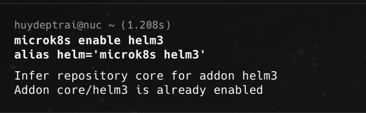
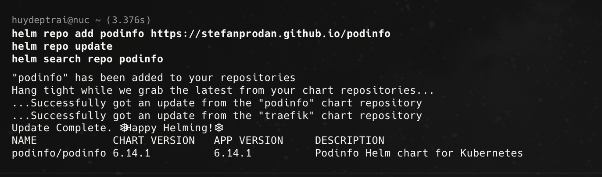
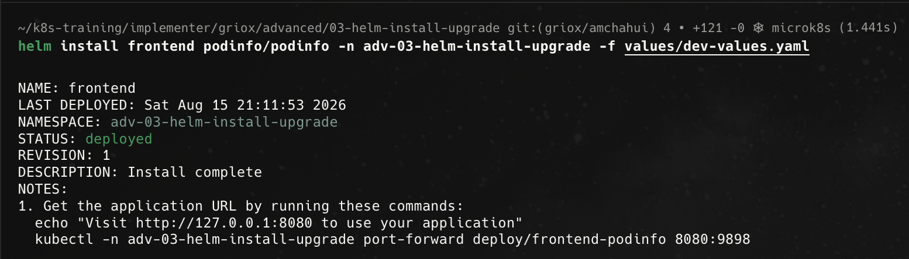
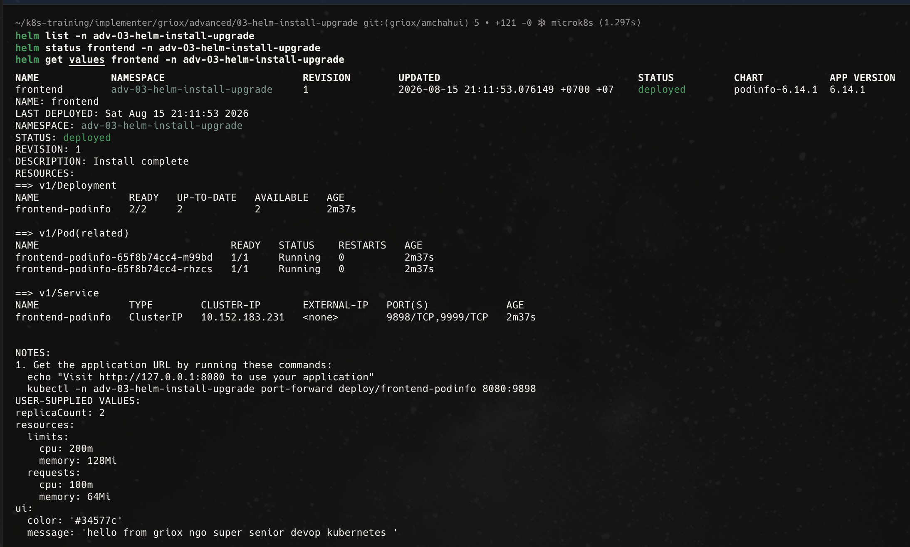
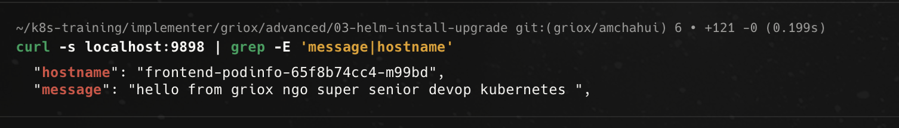
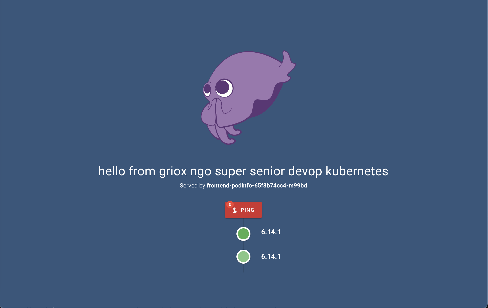
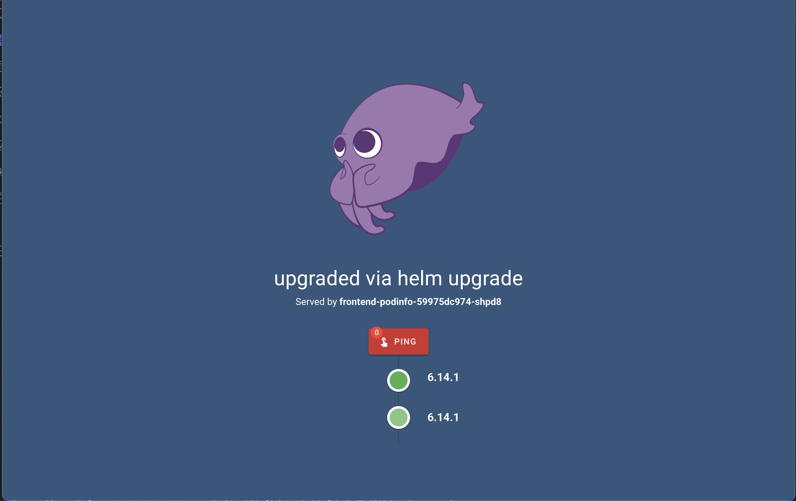
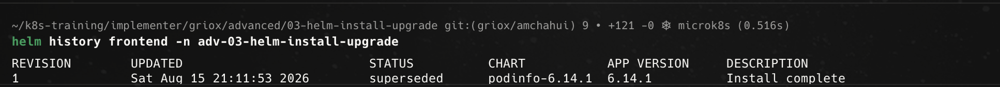
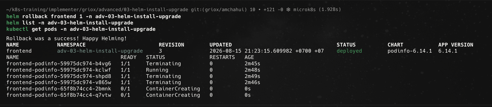
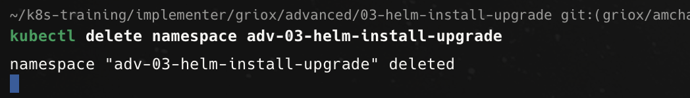

# Bài Advanced 03 — Helm install / upgrade / rollback

Tài liệu này ghi lại quá trình thực hiện bài [advanced/03-helm-install-upgrade/README.md](/Users/huyngo/k8s-training/advanced/03-helm-install-upgrade/README.md) theo đúng flow của bài lab. Bài thực hành tập trung vào quy trình quản lý vòng đời ứng dụng bằng Helm với vai trò người dùng (Helm consumer): thêm repo, cài đặt release từ chart có sẵn, kiểm tra thông tin, nâng cấp (upgrade), theo dõi lịch sử (history), khôi phục phiên bản (rollback) và dọn dẹp tài nguyên.

## 1. Kích hoạt và cấu hình Helm 3 (Prerequisites)

Trước khi thực hiện bài lab, em kích hoạt addon `helm3` trên cụm MicroK8s và thiết lập alias `helm='microk8s helm3'` để có thể thao tác với các câu lệnh Helm tiêu chuẩn một cách thuận tiện.

Ảnh bằng chứng:

## 2. Thêm Helm repository và cập nhật chart

Em tiến hành thêm repository `podinfo` từ địa chỉ `https://stefanprodan.github.io/podinfo`, sau đó chạy `helm repo update` để đồng bộ danh sách chart mới nhất và tìm kiếm chart `podinfo` bằng lệnh `helm search repo podinfo`. Kết quả tìm thấy chart `podinfo/podinfo` phiên bản `6.14.1`.

Ảnh bằng chứng:

## 3. Cài đặt Helm Release với values tùy biến

Sau khi cấu hình các thông số cần thiết trong file `values/dev-values.yaml` (bao gồm `replicaCount: 2` và thông điệp UI), em tạo namespace `adv-03-helm-install-upgrade` và tiến hành cài đặt release có tên `frontend` từ chart `podinfo/podinfo`.

Ảnh bằng chứng:

## 4. Kiểm tra trạng thái và thông tin của Release (Inspect release)

Sau khi cài đặt thành công, em sử dụng các câu lệnh kiểm tra:
- `helm list -n adv-03-helm-install-upgrade` để xem danh sách release (hiển thị release `frontend` ở revision 1, trạng thái `deployed`).
- `helm status frontend -n adv-03-helm-install-upgrade` để kiểm tra chi tiết trạng thái triển khai của Deployment, Pods và Service liên quan.
- `helm get values frontend -n adv-03-helm-install-upgrade` để xem lại các giá trị cấu hình tùy biến đã truyền vào khi cài đặt.

Ảnh bằng chứng:

## 5. Truy cập và kiểm tra phản hồi từ ứng dụng

Em tiến hành port-forward cổng `9898` của Service `frontend` và thực hiện kiểm tra ứng dụng:
- Dùng `curl` gửi request đến `localhost:9898` để xác nhận `hostname` của Pod và thông điệp `message` trả về khớp với giá trị đã cấu hình trong `dev-values.yaml`.
- Mở giao diện web trên trình duyệt để kiểm tra trực quan thông điệp hiển thị và tên Pod đang phục vụ request.

Ảnh bằng chứng:

## 6. Nâng cấp Release (Upgrade release)

Em thực hiện nâng cấp release `frontend` bằng lệnh `helm upgrade`, cập nhật số lượng replica lên 4 (`--set replicaCount=4`) và thay đổi nội dung thông điệp hiển thị (`--set ui.message="upgraded via helm upgrade"`). Sau đó, em truy cập lại giao diện web để xác nhận thông điệp mới đã được cập nhật thành công và được phục vụ bởi Pod mới.

Ảnh bằng chứng:

## 7. Xem lịch sử các phiên bản Release (Release history)

Em sử dụng lệnh `helm history frontend -n adv-03-helm-install-upgrade` để theo dõi toàn bộ lịch sử các revision của release. Hệ thống ghi nhận revision 1 đã được thay thế (`superseded`) khi thực hiện nâng cấp.

Ảnh bằng chứng:

## 8. Rollback về phiên bản trước

Để khôi phục trạng thái ứng dụng về bản cài ban đầu, em thực thi lệnh `helm rollback frontend 1 -n adv-03-helm-install-upgrade`. Sau khi rollback:
- `helm list` cập nhật release lên revision 3.
- `kubectl get pods` hiển thị quá trình terminate các Pod của revision 2 (4 pods) và khởi tạo lại 2 Pods tương ứng với cấu hình của revision 1.

Ảnh bằng chứng:

## 9. Dọn dẹp tài nguyên (Cleanup)

Sau khi hoàn tất toàn bộ các bước thực hành và kiểm tra rollback, em tiến hành xóa namespace `adv-03-helm-install-upgrade` để dọn dẹp sạch toàn bộ tài nguyên đã tạo trong cluster.

Ảnh bằng chứng:

## Tổng kết

Qua bài thực hành này, em đã nắm vững quy trình quản lý ứng dụng thông qua Helm:

- Kích hoạt addon Helm 3 và thiết lập alias trong MicroK8s.
- Thao tác thêm repository, cập nhật chart index và tìm kiếm chart.
- Cài đặt và cấu hình release với file `values.yaml` tùy biến.
- Sử dụng các lệnh `helm list`, `helm status`, `helm get values` để kiểm tra tài nguyên.
- Thực hiện nâng cấp (upgrade) cấu hình release trực tiếp bằng command-line flags.
- Quản lý lịch sử triển khai bằng `helm history` và khôi phục trạng thái nhanh chóng với `helm rollback`.
- Dọn dẹp tài nguyên môi trường sau khi hoàn thành.
