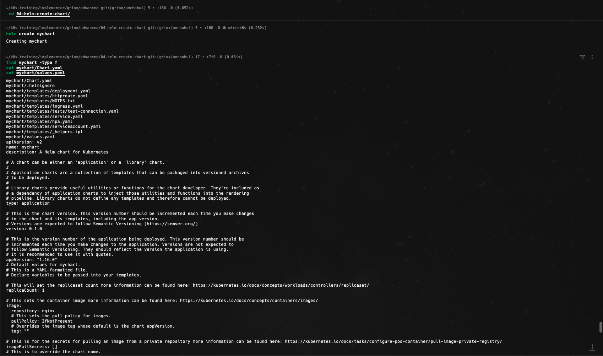
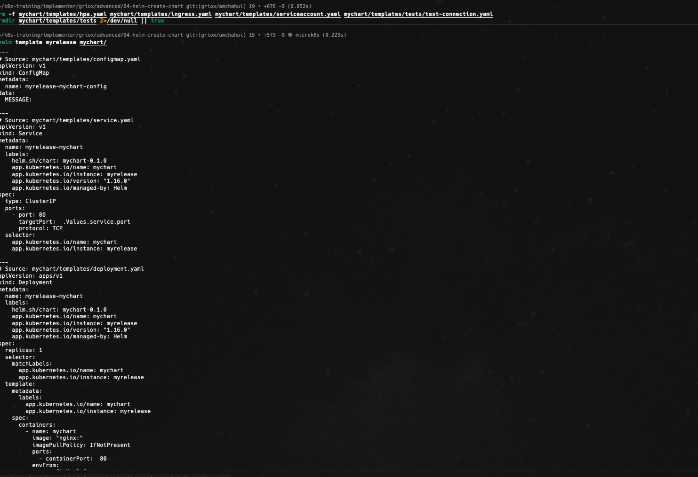
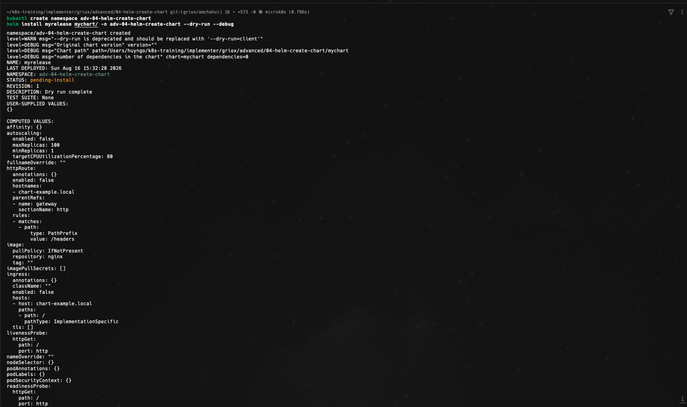
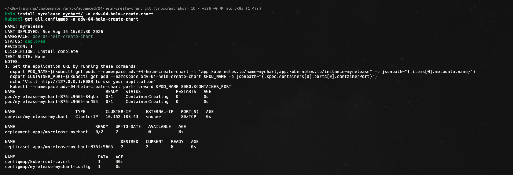
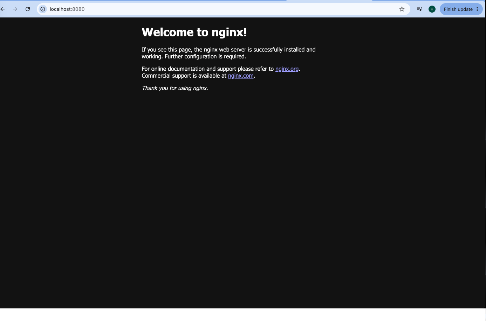
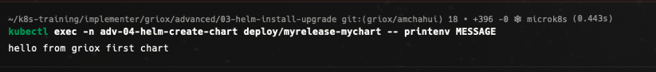
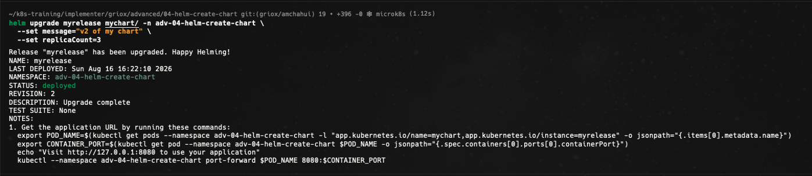
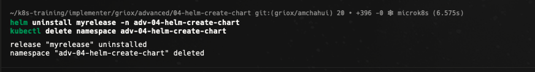

# Bài Advanced 04 — Creating your own Helm chart

Tài liệu này ghi lại quá trình thực hiện bài [advanced/04-helm-create-chart/README.md](/Users/huyngo/k8s-training/advanced/04-helm-create-chart/README.md) theo đúng flow của bài lab. Bài thực hành hướng dẫn cách khởi tạo một bộ khung Helm chart từ đầu bằng lệnh `helm create`, thay thế các file mẫu mặc định bằng các template và values tùy chỉnh theo ứng dụng thực tế (Deployment, Service, ConfigMap), kiểm tra render cú pháp cục bộ, chạy dry-run trên cluster, cài đặt release, kiểm tra ứng dụng và nâng cấp (upgrade) cấu hình.

## 1. Khởi tạo bộ khung Chart (Scaffold chart)

Em bắt đầu bài lab bằng việc chạy lệnh `helm create mychart` để tự động sinh cấu trúc khung chuẩn cho một Helm chart bao gồm `Chart.yaml`, `values.yaml`, thư mục `templates/`, `NOTES.txt` và `_helpers.tpl`. Sau đó, em sử dụng các lệnh `find` và `cat` để kiểm tra các file cấu hình mặc định vừa được tạo ra.

Ảnh bằng chứng:

## 2. Tùy chỉnh template, dọn dẹp file thừa và render template cục bộ

Sau khi cập nhật các giá trị trong `values.yaml` và hoàn thiện các template (`deployment.yaml`, `service.yaml`, bổ sung `configmap.yaml`), em tiến hành xóa bỏ các file template mặc định không sử dụng đến trong bài lab (`hpa.yaml`, `ingress.yaml`, `serviceaccount.yaml`, thư mục `tests`). Tiếp theo, em chạy lệnh `helm template myrelease mychart/` để kiểm tra quá trình render YAML cục bộ, đảm bảo không có lỗi cú pháp và các giá trị cấu hình được điền chính xác vào manifest trước khi triển khai.

Ảnh bằng chứng:

## 3. Tạo namespace và chạy thử nghiệm (Dry-run)

Em tạo namespace `adv-04-helm-create-chart` và thực thi lệnh cài đặt thử nghiệm với cờ `--dry-run --debug`. Thao tác này giúp xác thực toàn bộ manifest đã render với Kubernetes API server thực tế nhằm phát hiện sớm các lỗi schema mà không làm thay đổi trạng thái cluster.

Ảnh bằng chứng:

## 4. Cài đặt Release chính thức vào Cluster

Sau khi bước dry-run hoàn tất không có lỗi, em tiến hành cài đặt chính thức release `myrelease` vào namespace `adv-04-helm-create-chart`. Em sử dụng lệnh `kubectl get all,configmap` để xác nhận các tài nguyên gồm Deployment, Pods, Service và ConfigMap đã được tạo thành công trên cụm.

Ảnh bằng chứng:

## 5. Kiểm tra truy cập ứng dụng qua Port-Forward

Để xác thực ứng dụng Nginx đang phục vụ lưu lượng, em thiết lập `port-forward` cổng `8080` của máy tính tới cổng `80` của Service `myrelease-mychart`. Khi truy cập địa chỉ `http://localhost:8080` trên trình duyệt, trang chào mừng mặc định của Nginx hiển thị thành công xác nhận web server hoạt động ổn định.

Ảnh bằng chứng:

## 6. Xác thực biến môi trường từ ConfigMap trong Pod

Em sử dụng lệnh `kubectl exec` vào Deployment `myrelease-mychart` để in giá trị biến môi trường `MESSAGE`. Kết quả trả về đúng chuỗi `hello from griox first chart` chứng minh template ConfigMap và cấu hình `envFrom` trong Deployment đã được inject chính xác vào container.

Ảnh bằng chứng:

## 7. Nâng cấp Release với giá trị mới (Upgrade release)

Em thực hiện nâng cấp release `myrelease` bằng lệnh `helm upgrade`, truyền các tham số ghi đè trực tiếp gồm `--set message="v2 of my chart"` và `--set replicaCount=3`. Quá trình upgrade hoàn tất với `REVISION: 2`, số lượng Pods được scale lên 3 và thông điệp mới được cập nhật vào hệ thống.

Ảnh bằng chứng:

## 8. Dọn dẹp tài nguyên (Cleanup)

Sau khi hoàn thành bài thực hành, em thực hiện gỡ bỏ release bằng lệnh `helm uninstall myrelease` và xóa namespace `adv-04-helm-create-chart` để giải phóng toàn bộ tài nguyên trên cụm MicroK8s.

Ảnh bằng chứng:

## Tổng kết

Qua bài thực hành này, em đã nắm vững quy trình tự xây dựng và quản lý một Helm chart hoàn chỉnh:

- Sử dụng `helm create` để sinh bộ khung chart chuẩn công nghiệp.
- Hiểu cấu trúc các thành phần cốt lõi: `Chart.yaml`, `values.yaml`, `_helpers.tpl` và thư mục `templates/`.
- Tự viết và tùy biến các template Kubernetes declarative kết hợp Go templating (`Deployment`, `Service`, `ConfigMap`).
- Thực hành quy trình kiểm thử hai bước: render manifest cục bộ bằng `helm template` và kiểm tra schema qua `helm install --dry-run --debug`.
- Triển khai, port-forward kiểm tra web app, verify injection biến môi trường và thực hiện `helm upgrade` tham số động.
- Dọn dẹp môi trường sạch sẽ sau khi hoàn tất.
