# Bài Advanced 05 — Packaging and pushing Helm charts

Tài liệu này ghi lại quá trình thực hiện bài [advanced/05-helm-package-push/README.md](/Users/huyngo/k8s-training/advanced/05-helm-package-push/README.md) theo đúng flow của bài lab. Bài thực hành tập trung vào quy trình đóng gói Helm chart thành file lưu trữ versioned `.tgz`, đẩy chart lên kho lưu trữ OCI Registry nội bộ của MicroK8s, kiểm tra tính toàn vẹn và cài đặt/nâng cấp ứng dụng trực tiếp từ OCI Registry mà không cần chạm vào mã nguồn cục bộ.

## 1. Kích hoạt và xác thực MicroK8s Registry (Prerequisites)

Trước khi thực hiện đóng gói và phân phối chart, em kích hoạt addon `registry` trên cụm MicroK8s và kiểm tra trạng thái của Pod `registry` trong namespace `container-registry`. Kết quả xác nhận registry đang hoạt động ở trạng thái `Running` trên cổng NodePort `32000`.

Ảnh bằng chứng:

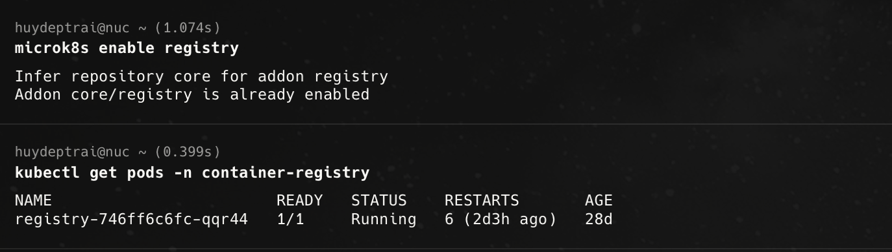

## 2. Đóng gói Helm Chart thành file lưu trữ .tgz (Package chart)

Em sử dụng lệnh `helm package` để đóng gói thư mục chart đã xây dựng ở bài trước thành một gói lưu trữ chuẩn `.tgz`. Lệnh `ls *.tgz` xác nhận gói chart đã được tạo thành công trong thư mục làm việc.

Ảnh bằng chứng:

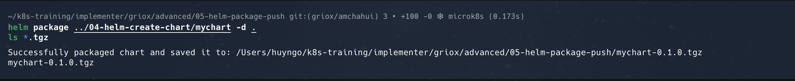

## 3. Cấu hình kịch bản tự động hóa Push Chart

Em cấu hình file script `scripts/push-chart.sh` bằng cách điền chính xác đường dẫn thư mục chart nguồn (`CHART_DIR`), địa chỉ OCI registry của máy MicroK8s (`REGISTRY="nuc.tail66abd2.ts.net:32000"`) và đường dẫn lưu trữ (`REPO_PATH="helm-charts"`).

Ảnh bằng chứng:

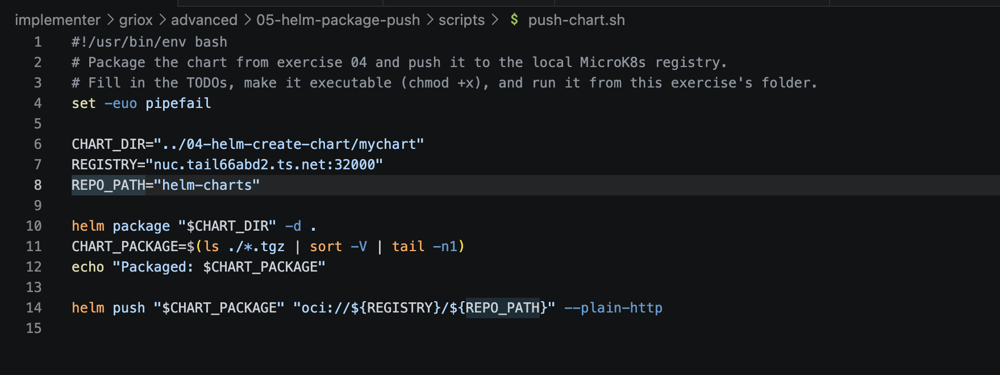

## 4. Thực thi script đẩy Chart lên OCI Registry

Em cấp quyền thực thi và chạy script `./scripts/push-chart.sh`. Quá trình thực thi tự động đóng gói chart và sử dụng lệnh `helm push ... --plain-http` để đẩy gói lên kho lưu trữ OCI, đồng thời sinh mã băm SHA256 digest xác thực việc tải lên hoàn tất.

Ảnh bằng chứng:

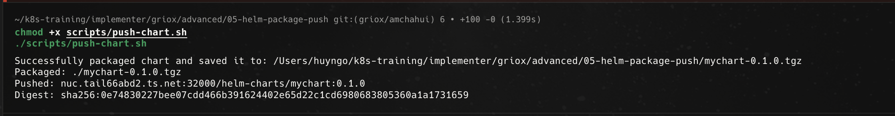

## 5. Xác thực thông tin Chart trên OCI Registry

Để kiểm tra chart đã lưu trữ thành công trên OCI Registry, em thực hiện hai câu lệnh xác thực:
- `helm show chart oci://... --plain-http`: Đọc trực tiếp metadata của chart trên remote registry.
- `helm pull oci://... --plain-http -d /tmp`: Tải gói chart từ OCI Registry về thư mục `/tmp` và dùng lệnh `ls` xác nhận file `.tgz` đã được kéo về đầy đủ.

Ảnh bằng chứng:

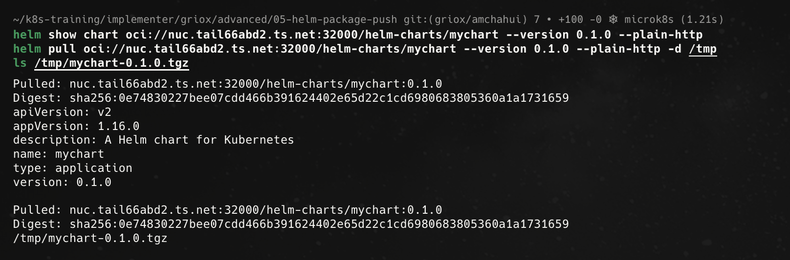

## 6. Cài đặt Release trực tiếp từ OCI Registry

Em tạo namespace `adv-05-helm-package-push` và tiến hành cài đặt release `from-registry` trực tiếp từ URL của OCI Registry (`oci://nuc.tail66abd2.ts.net:32000/helm-charts/mychart`). Sau đó, em dùng lệnh `kubectl get all` để xác nhận toàn bộ Pods, Deployment và Service đã khởi tạo thành công mà không cần dùng đến thư mục chart cục bộ.

Ảnh bằng chứng:

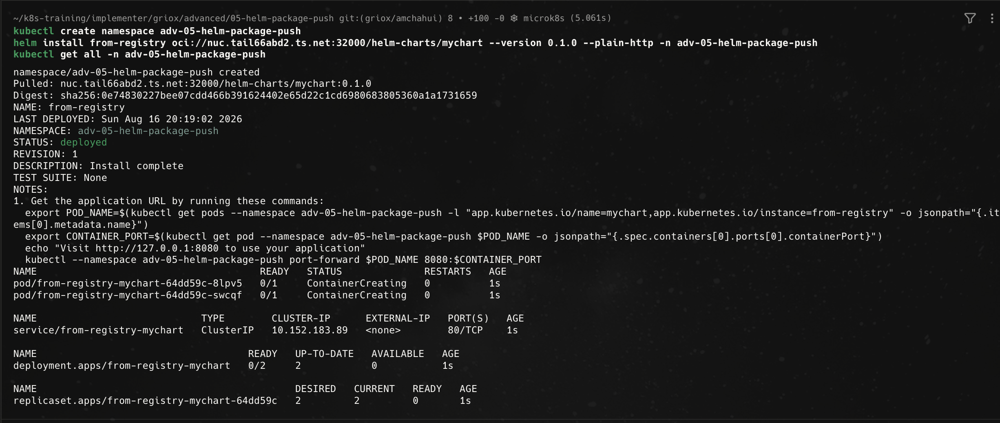

## 7. Bonus Challenge — Nâng cấp Release trực tiếp từ OCI Registry

Ở phần thử thách nâng cao, em thực hiện chu trình cập nhật phiên bản ứng dụng chuẩn CI/CD hoàn toàn qua OCI Registry:

1. Kiểm tra trạng thái ban đầu của release `from-registry` với `REVISION: 1`.
2. Cập nhật `version: 0.3.0` trong `Chart.yaml`.
3. Thay đổi các giá trị cấu hình trong `values.yaml` (tăng số lượng `replicaCount: 4` và đổi nội dung `message: "hello from registry version 3"`).
4. Chạy lại script `./scripts/push-chart.sh` để đóng gói và push bản `0.3.0` lên Registry.
5. Thực thi lệnh `helm upgrade` trỏ trực tiếp tới URL `oci://... --version 0.3.0` và kiểm tra lại bằng `helm list` xác nhận release đã được nâng cấp lên `REVISION: 2` cùng phiên bản chart `mychart-0.3.0`.

Ảnh bằng chứng:

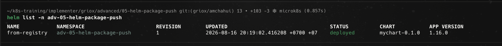
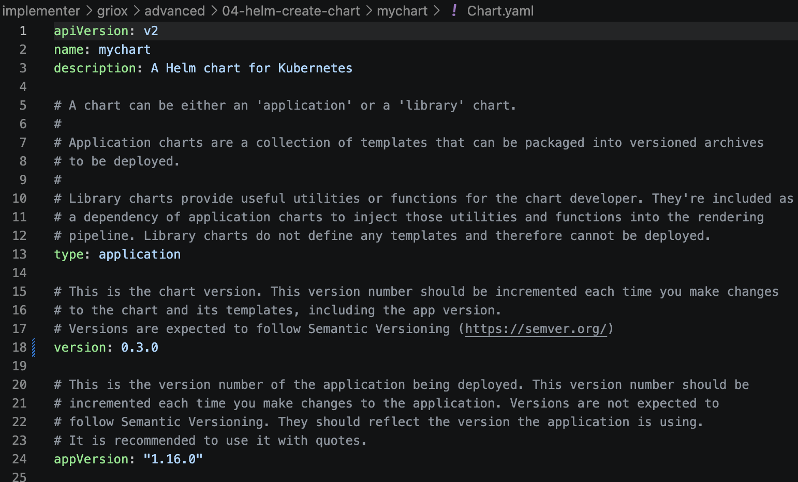
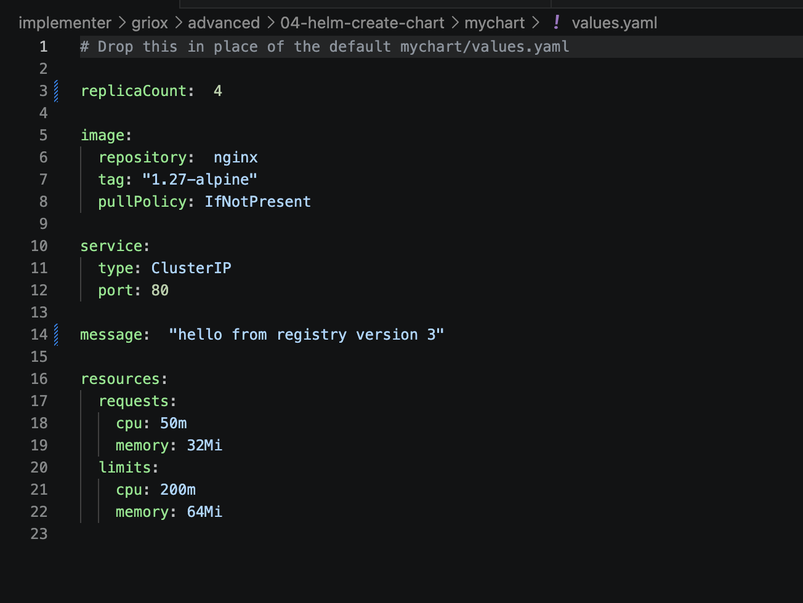
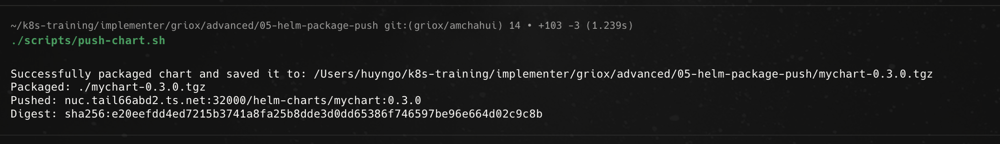
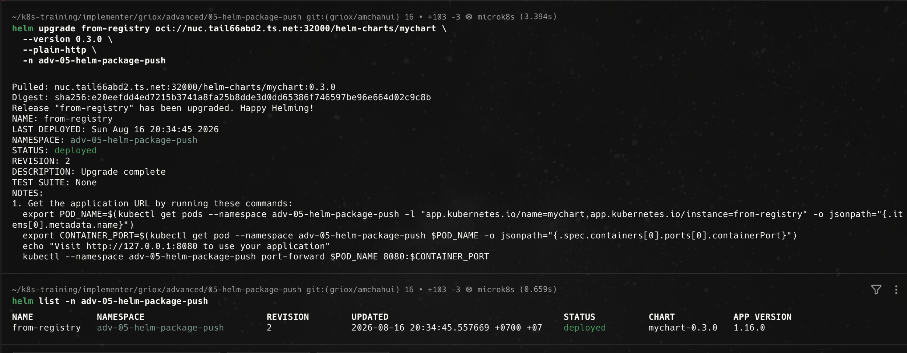

## 8. Dọn dẹp tài nguyên (Cleanup)

Sau khi hoàn tất bài thực hành và kiểm thử các tính năng, em tiến hành gỡ bỏ release `from-registry`, xóa namespace `adv-05-helm-package-push` và dọn sạch các file nén `.tgz` trên máy tính cá nhân.

Ảnh bằng chứng:

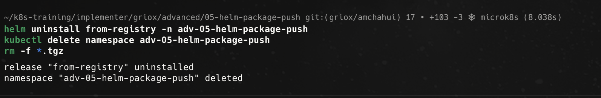

## Tổng kết

Qua bài thực hành này, em đã làm chủ toàn bộ quy trình đóng gói và phân phối Helm chart theo tiêu chuẩn OCI hiện đại:

- Kích hoạt và kết nối OCI Container Registry trên cụm MicroK8s.
- Hiểu và thực hiện thao tác đóng gói chart thành gói lưu trữ versioned `.tgz` bằng `helm package`.
- Sử dụng `helm push` với cờ `--plain-http` để phát hành chart lên OCI Registry.
- Xác thực và tải chart về từ xa thông qua các lệnh `helm show chart` và `helm pull`.
- Triển khai (`helm install`) và nâng cấp (`helm upgrade`) ứng dụng trực tiếp từ OCI Registry mà không phụ thuộc vào source code local — mô hình cốt lõi của triển khai GitOps và pipeline CI/CD tự động.
- Dọn dẹp môi trường sạch sẽ sau khi kết thúc bài lab.
