# Bài 01 - Pods

Tài liệu này ghi lại quá trình thực hiện bài [basic/01-pods/README.md](/Users/huyngo/k8s-training/basic/01-pods/README.md) theo đúng flow của bài lab. Môi trường thực hành là máy local chứa source code và SSH vào máy `microk8s` để chạy các lệnh Kubernetes.

## 1. Cấu hình MicroK8s

Trước khi bắt đầu bài lab, em cấu hình các thành phần cần thiết của MicroK8s để phục vụ quá trình học Kubernetes như registry, Helm, Metrics Server, MetalLB và Traefik Ingress. Các ảnh dưới đây là bằng chứng cho phần cấu hình ban đầu.

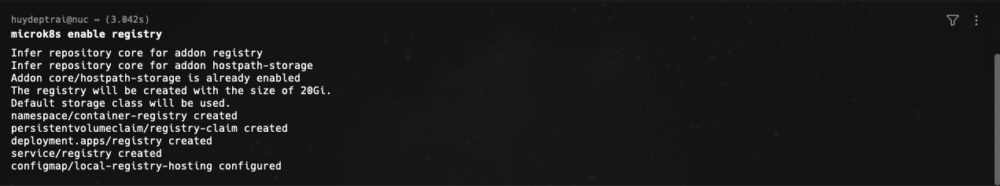
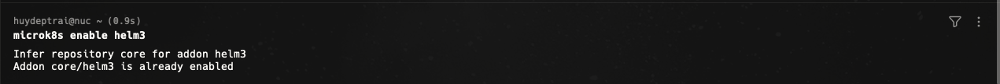
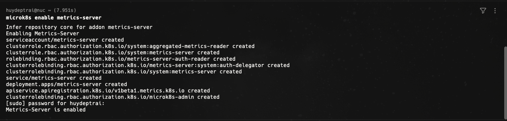
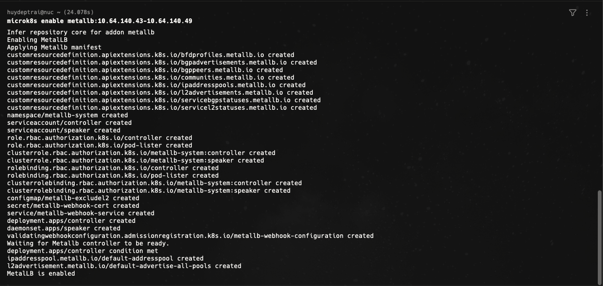
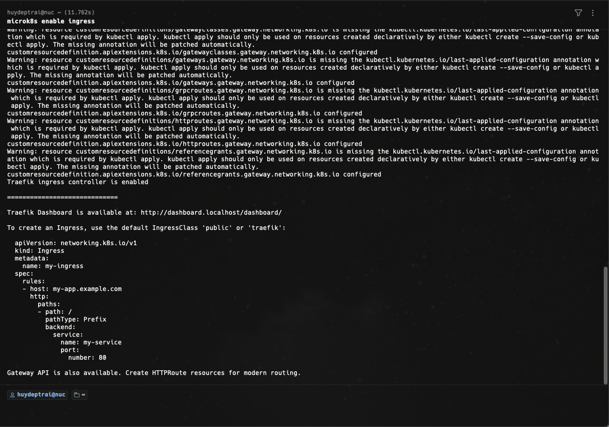

## 2. Tạo namespace cho bài Pods

Em tạo namespace `basic-01-pods` để cô lập toàn bộ tài nguyên của bài thực hành. Việc tách namespace giúp dễ quan sát, dễ dọn dẹp và tránh ảnh hưởng sang các bài khác.

Lệnh sử dụng:

```bash
ssh huydeptrai@nuc.tail66abd2.ts.net "microk8s kubectl create namespace basic-01-pods"
```

Ảnh bằng chứng:

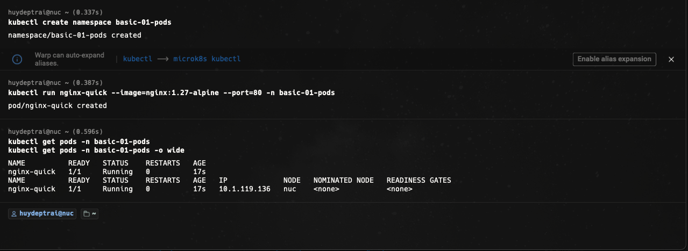

## 3. Quan sát thông tin Pod bằng describe

Sau khi tạo Pod, em dùng `kubectl describe pod` để xem trạng thái chi tiết của `nginx-pod`. Ở bước này có thể kiểm tra được node đang chạy Pod, địa chỉ IP của Pod, container image, trạng thái container và chuỗi sự kiện như `Scheduled`, `Pulled`, `Created`, `Started`.

Lệnh sử dụng:

```bash
ssh huydeptrai@nuc.tail66abd2.ts.net "microk8s kubectl describe pod nginx-pod -n basic-01-pods"
```

Ảnh bằng chứng:

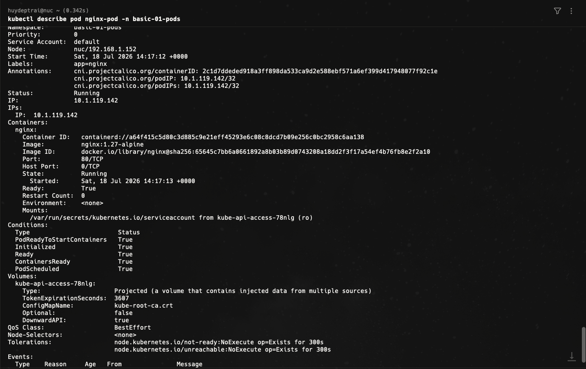

## 4. Chỉnh sửa file pod.yaml

Theo yêu cầu của bài, em chỉnh sửa file `manifests/pod.yaml` để khai báo Pod theo hướng declarative. Ở bước này em điền label `app: nginx` và image `nginx:1.27-alpine` cho container chính.

File được chỉnh:

`basic/01-pods/manifests/pod.yaml`

Ảnh bằng chứng:

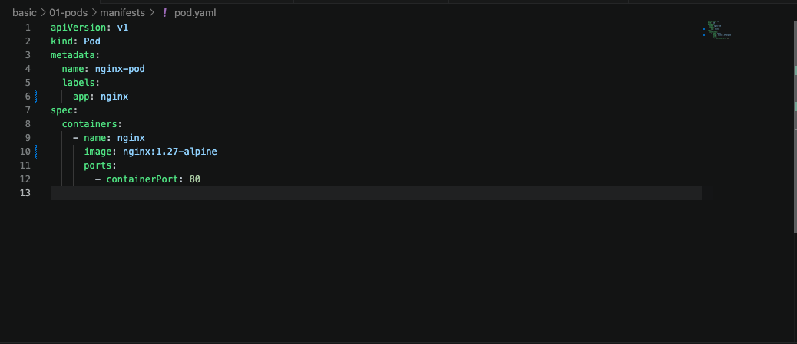

## 5. Apply file manifest để tạo Pod

Do source code nằm trên máy local còn cluster nằm trên máy remote, em không chạy `kubectl apply -f manifests/pod.yaml` trực tiếp trong phiên SSH. Thay vào đó, em truyền nội dung file YAML từ local sang máy remote qua `ssh`, rồi để `microk8s kubectl apply -f -` đọc manifest từ standard input.

Lệnh sử dụng:

```bash
cat basic/01-pods/manifests/pod.yaml | ssh huydeptrai@nuc.tail66abd2.ts.net "microk8s kubectl apply -f - -n basic-01-pods"
```

Ảnh bằng chứng:

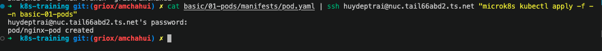

## 6. Port-forward từ Pod ra cổng 8080

Để truy cập Pod từ máy local, em dùng `port-forward` ánh xạ cổng `8080` trên máy local tới cổng `80` của container `nginx` trong Pod. Bước này cho thấy dù Pod chạy trong cluster, em vẫn có thể mở truy cập HTTP từ máy cá nhân để kiểm tra dịch vụ.

Lệnh sử dụng:

```bash
ssh huydeptrai@nuc.tail66abd2.ts.net "microk8s kubectl port-forward pod/nginx-pod 8080:80 -n basic-01-pods"
```

Ảnh bằng chứng:

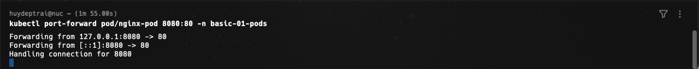

## 7. Kiểm tra kết quả port-forward

Sau khi port-forward hoạt động, em mở một terminal khác hoặc trình duyệt để truy cập `localhost:8080`. Kết quả trả về trang welcome của Nginx chứng minh Pod đang chạy ổn và cổng đã được forward thành công.

Ảnh bằng chứng:

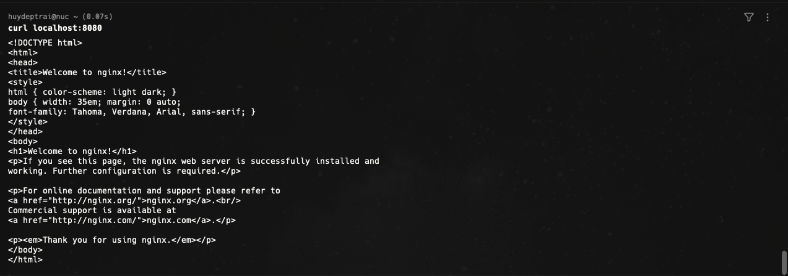
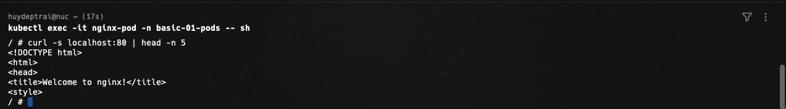

## 8. Xóa namespace để dọn dẹp môi trường

Sau khi hoàn tất bài cơ bản, em xóa namespace `basic-01-pods` để dọn dẹp toàn bộ tài nguyên đã tạo. Cách này giúp đảm bảo môi trường sạch trước khi chuyển sang bài tiếp theo.

Lệnh sử dụng:

```bash
ssh huydeptrai@nuc.tail66abd2.ts.net "microk8s kubectl delete namespace basic-01-pods"
```

Ảnh bằng chứng:

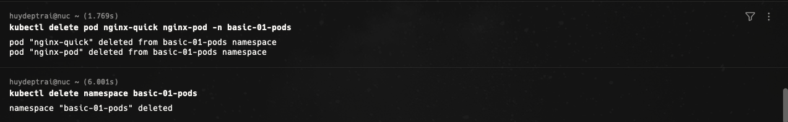

## 9. Bonus Challenge - Cập nhật YAML cho Pod nhiều container

Ở phần bonus challenge, em mở rộng `pod.yaml` để một Pod chứa hai container:

- Container `nginx` chạy web server.
- Container `toolbox` dùng image `busybox:1.36` và chạy lệnh `sleep 3600`.

Mục đích của phần này là hiểu rằng một Pod có thể chứa nhiều container liên quan chặt chẽ với nhau, cùng chia sẻ network và vòng đời. Đây là nền tảng để làm quen với mô hình sidecar trong Kubernetes.

Ảnh bằng chứng:

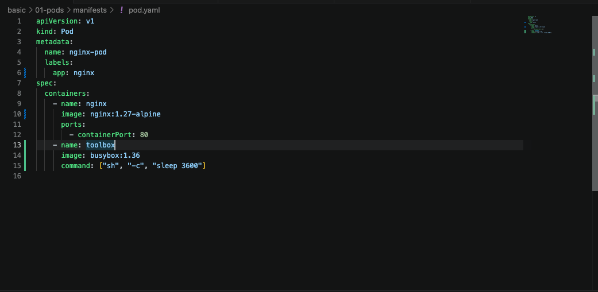

## 10. Bonus Challenge - Kết quả chạy và thao tác với từng container

Sau khi apply lại manifest của bonus challenge, em có thể thao tác riêng với từng container bằng tham số `-c`, ví dụ:

```bash
ssh huydeptrai@nuc.tail66abd2.ts.net "microk8s kubectl logs nginx-pod -n basic-01-pods -c nginx"
ssh huydeptrai@nuc.tail66abd2.ts.net "microk8s kubectl logs nginx-pod -n basic-01-pods -c toolbox"
ssh huydeptrai@nuc.tail66abd2.ts.net "microk8s kubectl exec -it nginx-pod -n basic-01-pods -c nginx -- sh"
ssh huydeptrai@nuc.tail66abd2.ts.net "microk8s kubectl exec -it nginx-pod -n basic-01-pods -c toolbox -- sh"
```

Kết quả của phần này giúp phân biệt rõ:

- `nginx-pod` là tên Pod.
- `nginx` và `toolbox` là tên hai container nằm trong cùng Pod.
- Khi Pod có nhiều container, cần chỉ rõ container đích bằng `-c`.

Ảnh bằng chứng:

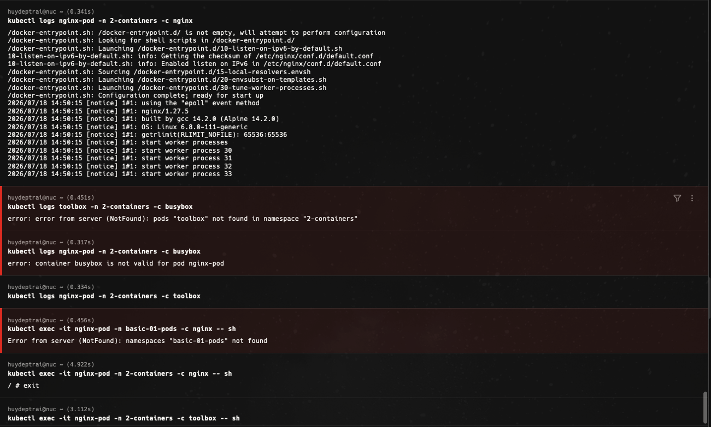

## Tổng kết

Qua bài này, em đã thực hành được các thao tác nền tảng với Pod trong Kubernetes:

- Tạo namespace để cô lập tài nguyên.
- Tạo và apply Pod bằng file manifest YAML.
- Dùng `describe` để quan sát trạng thái Pod.
- Dùng `port-forward` để truy cập dịch vụ từ máy local.
- Dọn dẹp tài nguyên bằng cách xóa namespace.
- Mở rộng sang mô hình Pod nhiều container trong bonus challenge.

Đây là kiến thức nền rất quan trọng trước khi học tiếp về Deployment, Service, ConfigMap, Secret và các đối tượng Kubernetes khác.
