# Bài 02 - Deployments

Tài liệu này ghi lại quá trình thực hiện bài [basic/02-deployments/README.md](/Users/huyngo/k8s-training/basic/02-deployments/README.md) theo đúng flow của bài lab. Môi trường thực hành là máy local chứa source code và SSH vào máy `microk8s` để chạy các lệnh Kubernetes.

## 1. Tạo namespace cho bài Deployments

Em tạo namespace `basic-02-deployments` để cô lập toàn bộ tài nguyên của bài thực hành. Việc tách namespace giúp dễ quản lý Deployment, ReplicaSet và Pods mà không ảnh hưởng sang các bài khác.

Lệnh sử dụng:

```bash
ssh huydeptrai@nuc.tail66abd2.ts.net "microk8s kubectl create namespace basic-02-deployments"
```

Ảnh bằng chứng:

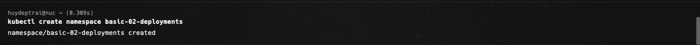

## 2. Chỉnh sửa file deployment.yaml

Theo yêu cầu của bài, em chỉnh sửa file `manifests/deployment.yaml` để khai báo Deployment theo hướng declarative. Ở bước này em điền số lượng replica ban đầu và image cho container `nginx`. Sau đó em bổ sung thêm phần `resources.requests` và `resources.limits` để phục vụ bonus challenge ở cuối bài.

File được chỉnh:

`basic/02-deployments/manifests/deployment.yaml`

Ảnh bằng chứng:

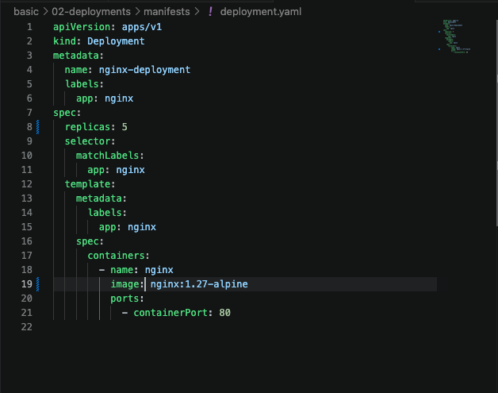

## 3. Apply manifest để tạo Deployment

Do source code nằm trên máy local còn cluster nằm trên máy remote, em không apply file trực tiếp trong phiên SSH. Thay vào đó, em truyền nội dung file YAML từ local sang máy remote qua `ssh`, rồi để `microk8s kubectl apply -f -` đọc manifest từ standard input.

Lệnh sử dụng:

```bash
cat basic/02-deployments/manifests/deployment.yaml | ssh huydeptrai@nuc.tail66abd2.ts.net "microk8s kubectl apply -f - -n basic-02-deployments"
```

Ảnh bằng chứng:

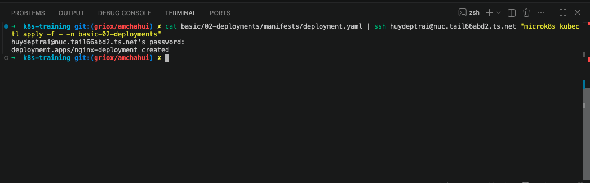

## 4. Theo dõi quá trình rollout

Sau khi Deployment được tạo, em dùng `kubectl rollout status` và `kubectl get deployments,replicasets,pods` để theo dõi quá trình rollout. Ở bước này có thể thấy rõ mối quan hệ giữa `Deployment`, `ReplicaSet` và các `Pods` được tạo ra tự động. Ảnh chụp cũng cho thấy có đúng một ReplicaSet được Deployment quản lý.

Lệnh sử dụng:

```bash
ssh huydeptrai@nuc.tail66abd2.ts.net "microk8s kubectl rollout status deployment/nginx-deployment -n basic-02-deployments"
ssh huydeptrai@nuc.tail66abd2.ts.net "microk8s kubectl get deployments,replicasets,pods -n basic-02-deployments"
```

Ảnh bằng chứng:

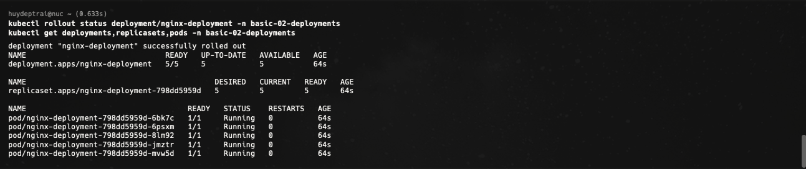

## 5. Inspect Deployment

Tiếp theo, em dùng `kubectl describe deployment` để quan sát chi tiết Deployment `nginx-deployment`. Ở đây có thể kiểm tra được `Replicas`, `StrategyType` là `RollingUpdate`, image đang chạy, trạng thái `Available`, `Progressing` và phần `Events` ở cuối output.

Lệnh sử dụng:

```bash
ssh huydeptrai@nuc.tail66abd2.ts.net "microk8s kubectl describe deployment nginx-deployment -n basic-02-deployments"
```

Ảnh bằng chứng:

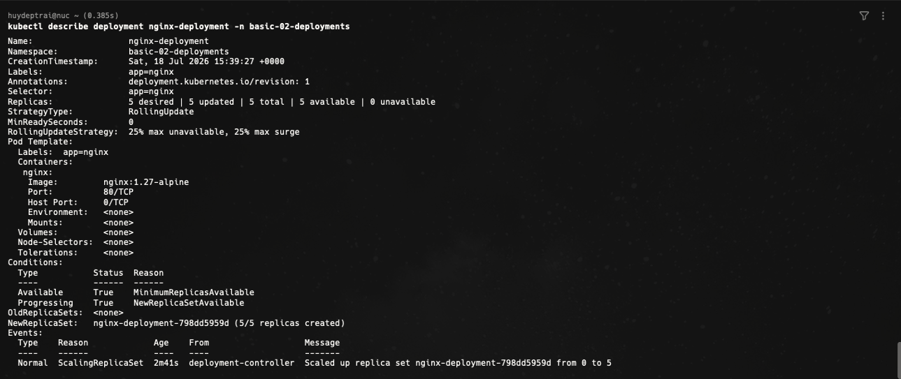

## 6. Cập nhật số lượng replicas

Theo flow của bài lab, bước này dùng `kubectl scale` để thay đổi số lượng replicas của Deployment. Trong quá trình thực hành, ảnh chụp cho thấy em đã scale Deployment lên `5` replicas rồi tiếp tục scale lên `7` replicas để quan sát sự thay đổi rõ hơn bằng `kubectl get pods -w`. Điều này vẫn minh họa đúng cơ chế controller của Deployment: khi desired state thay đổi, cluster sẽ tự điều chỉnh số lượng Pods tương ứng.

Lệnh sử dụng:

```bash
ssh huydeptrai@nuc.tail66abd2.ts.net "microk8s kubectl scale deployment/nginx-deployment --replicas=5 -n basic-02-deployments"
ssh huydeptrai@nuc.tail66abd2.ts.net "microk8s kubectl scale deployment/nginx-deployment --replicas=7 -n basic-02-deployments"
ssh huydeptrai@nuc.tail66abd2.ts.net "microk8s kubectl get pods -n basic-02-deployments -w"
```

Ảnh bằng chứng:

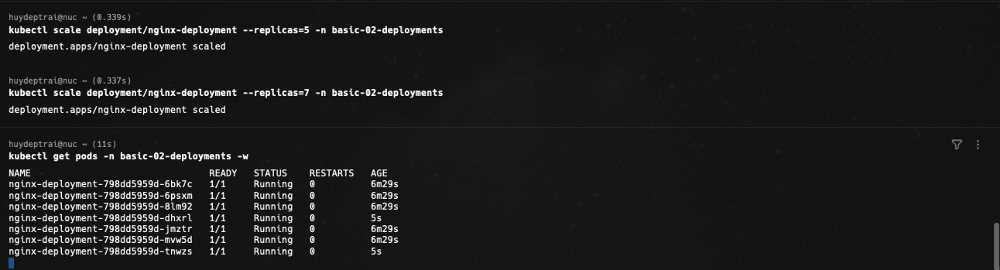

## 7. Xóa Pod và quan sát cơ chế self-healing

Một ý rất quan trọng của Deployment là self-healing. Em xóa các Pod đang chạy bằng `kubectl delete pod`, sau đó dùng `kubectl get pods` để quan sát. Kết quả cho thấy các Pod cũ chuyển sang trạng thái `Terminating`, trong khi các Pod mới được tạo lại và cuối cùng trở về `Running`. Đây là minh chứng cho việc ReplicaSet controller của Deployment luôn cố giữ cluster ở trạng thái mong muốn.

Lệnh sử dụng:

```bash
ssh huydeptrai@nuc.tail66abd2.ts.net "microk8s kubectl delete pod -n basic-02-deployments -l app=nginx --field-selector=status.phase=Running --wait=false"
ssh huydeptrai@nuc.tail66abd2.ts.net "microk8s kubectl get pods -n basic-02-deployments"
```

Ảnh bằng chứng:

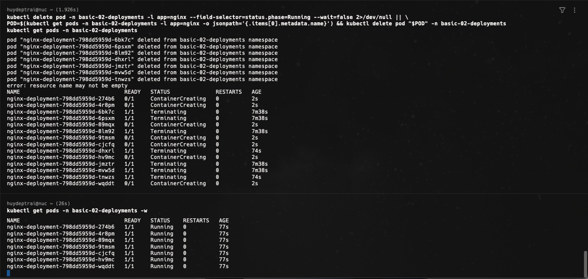

## 8. Xóa Deployment

Sau khi hoàn tất các bước kiểm tra chính, em xóa Deployment `nginx-deployment` để dọn dẹp workload của bài thực hành.

Lệnh sử dụng:

```bash
ssh huydeptrai@nuc.tail66abd2.ts.net "microk8s kubectl delete deployment nginx-deployment -n basic-02-deployments"
```

Ảnh bằng chứng:

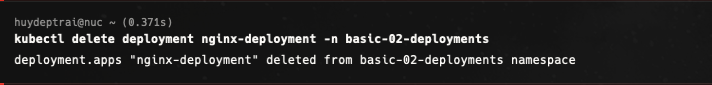

## 9. Xóa namespace để dọn dẹp môi trường

Sau khi xóa Deployment, em tiếp tục xóa namespace `basic-02-deployments` để dọn dẹp toàn bộ tài nguyên liên quan của bài lab.

Lệnh sử dụng:

```bash
ssh huydeptrai@nuc.tail66abd2.ts.net "microk8s kubectl delete namespace basic-02-deployments"
```

Ảnh bằng chứng:

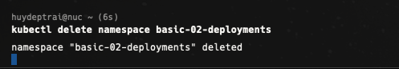

## 10. Bonus Challenge - Bổ sung resource requests và limits

Ở phần bonus challenge, em cập nhật file `deployment.yaml` để thêm `resources.requests` và `resources.limits` cho container `nginx`. Việc này giúp Kubernetes biết container tối thiểu cần bao nhiêu tài nguyên và tối đa được phép dùng bao nhiêu tài nguyên.

Ảnh bằng chứng:

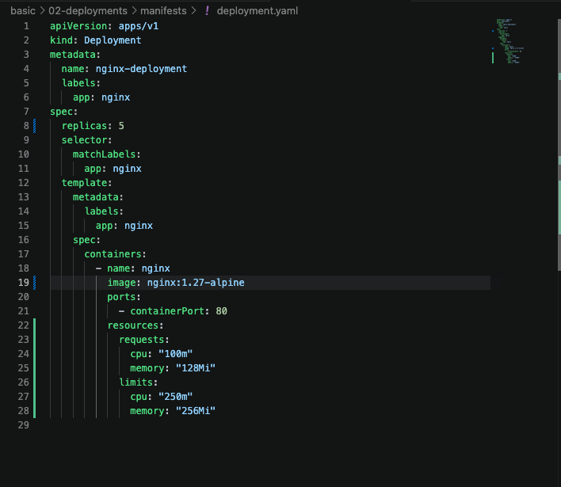

## 11. Bonus Challenge - Kiểm tra Allocated Resources trên node

Sau khi apply lại manifest có khai báo resource, em dùng `kubectl describe node` để tìm phần `Allocated resources`. Tại đây có thể thấy tổng hợp `Requests` và `Limits` của các workload đang chạy trên node, bao gồm cả Pods của Deployment vừa cấu hình. Đây là bước giúp em hiểu rõ hơn cách Kubernetes quản lý tài nguyên ở cấp node.

Lệnh sử dụng:

```bash
ssh huydeptrai@nuc.tail66abd2.ts.net "microk8s kubectl describe node"
```

Ảnh bằng chứng:

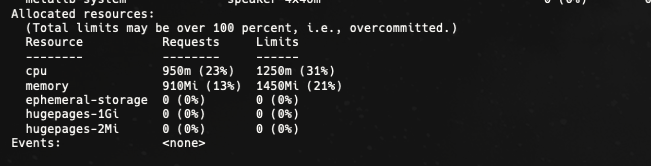

## Tổng kết

Qua bài này, em đã thực hành được các thao tác quan trọng với Deployment trong Kubernetes:

- Tạo namespace để cô lập tài nguyên.
- Tạo Deployment từ file manifest YAML.
- Theo dõi rollout và quan sát mối quan hệ giữa Deployment, ReplicaSet và Pods.
- Inspect Deployment để xem chiến lược cập nhật và trạng thái hoạt động.
- Scale số lượng replicas để thay đổi desired state.
- Quan sát cơ chế self-healing khi Pod bị xóa.
- Dọn dẹp tài nguyên bằng cách xóa Deployment và namespace.
- Bổ sung `requests` và `limits` để hiểu thêm về quản lý tài nguyên trong bonus challenge.

Đây là nền tảng rất quan trọng trước khi học sâu hơn về scaling, update strategy, rollback và các cơ chế triển khai workload trong Kubernetes.
