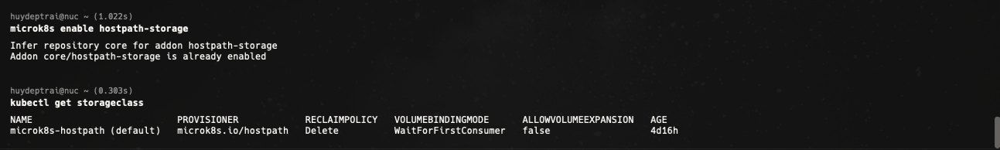
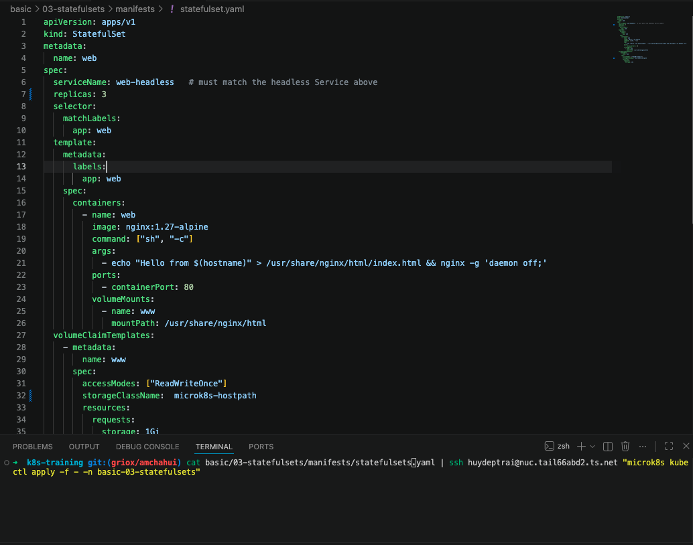
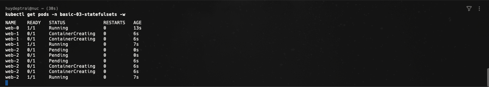
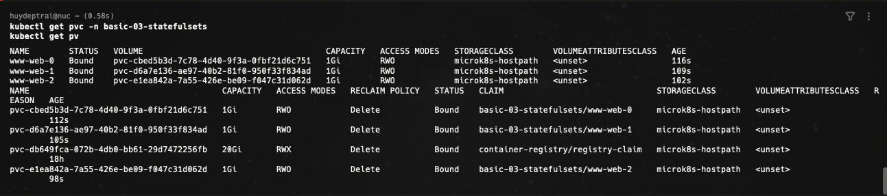
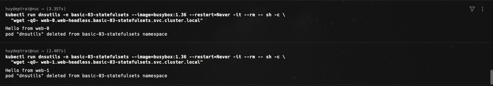
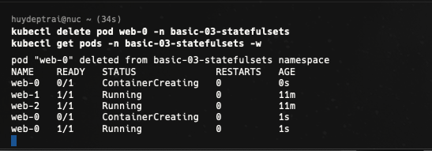
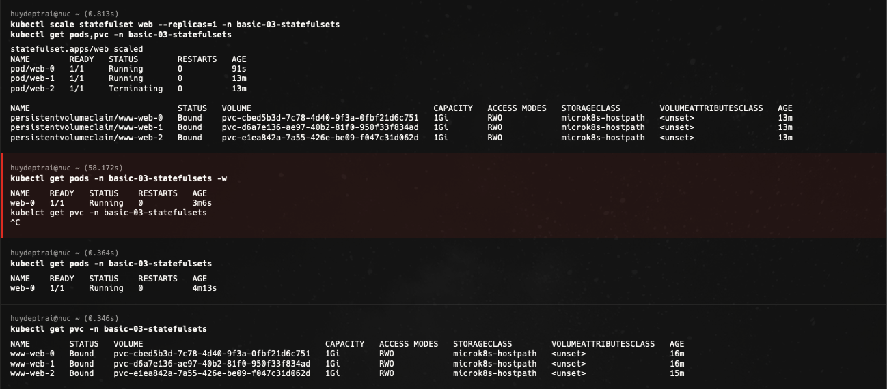
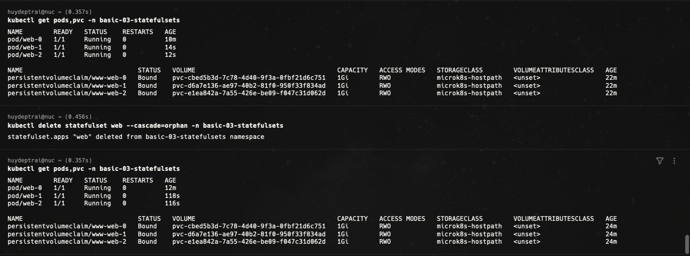

# Bài 03 - StatefulSets

Tài liệu này ghi lại quá trình thực hiện bài [basic/03-statefulsets/README.md](/Users/huyngo/k8s-training/basic/03-statefulsets/README.md) theo đúng flow của bài lab. Môi trường thực hành là máy local chứa source code và SSH vào máy `microk8s` để chạy các lệnh Kubernetes.

## 1. Bật hostpath storage và kiểm tra StorageClass

Trước khi triển khai StatefulSet, em bật addon `hostpath-storage` của MicroK8s để Kubernetes có thể dynamic provision PersistentVolume cho từng Pod. Sau đó em kiểm tra `StorageClass` và xác nhận lớp lưu trữ đang dùng là `microk8s-hostpath`.

Lệnh sử dụng:

```bash
ssh huydeptrai@nuc.tail66abd2.ts.net "microk8s enable hostpath-storage"
ssh huydeptrai@nuc.tail66abd2.ts.net "microk8s kubectl get storageclass"
```

Ảnh bằng chứng:



## 2. Tạo namespace cho bài StatefulSets

Theo flow của bài lab, bước tiếp theo là tạo namespace `basic-03-statefulsets` để cô lập tài nguyên. Bộ ảnh hiện tại không có ảnh chụp riêng cho thao tác tạo namespace, nên phần này được ghi theo đúng flow của README nguồn.

Lệnh sử dụng:

```bash
ssh huydeptrai@nuc.tail66abd2.ts.net "microk8s kubectl create namespace basic-03-statefulsets"
```

## 3. Tạo headless Service

StatefulSet cần một headless Service để cấp DNS ổn định cho từng Pod, ví dụ `web-0.web-headless.basic-03-statefulsets.svc.cluster.local`. Bộ ảnh hiện tại không có ảnh riêng cho bước apply file `headless-service.yaml`, nhưng đây là bước bắt buộc để phần kiểm tra DNS ở các bước sau hoạt động đúng.

Lệnh sử dụng:

```bash
cat basic/03-statefulsets/manifests/headless-service.yaml | ssh huydeptrai@nuc.tail66abd2.ts.net "microk8s kubectl apply -f - -n basic-03-statefulsets"
```

## 4. Chỉnh sửa file statefulset.yaml và apply StatefulSet

Ở bước này, em chỉnh sửa file `manifests/statefulset.yaml` để điền số lượng replica và `storageClassName` là `microk8s-hostpath`, sau đó apply manifest lên cluster. Trong file này, StatefulSet `web` được cấu hình để tạo Pod có danh tính ổn định (`web-0`, `web-1`, `web-2`) và mỗi Pod có một PVC riêng thông qua `volumeClaimTemplates`.

Lệnh sử dụng:

```bash
cat basic/03-statefulsets/manifests/statefulset.yaml | ssh huydeptrai@nuc.tail66abd2.ts.net "microk8s kubectl apply -f - -n basic-03-statefulsets"
```

Ảnh bằng chứng:



## 5. Quan sát ordered creation

Sau khi StatefulSet được tạo, em dùng `kubectl get pods -w` để theo dõi quá trình khởi tạo Pod theo thứ tự. Ảnh chụp cho thấy `web-0` lên `Running` trước, sau đó `web-1` mới được tạo, rồi tiếp đến `web-2`. Đây là một đặc tính rất khác so với Deployment, vì StatefulSet luôn triển khai tuần tự thay vì tạo các Pod một cách thay thế được.

Lệnh sử dụng:

```bash
ssh huydeptrai@nuc.tail66abd2.ts.net "microk8s kubectl get pods -n basic-03-statefulsets -w"
```

Ảnh bằng chứng:



## 6. Kiểm tra storage của từng Pod

Tiếp theo, em kiểm tra `PVC` và `PV` để xác nhận mỗi Pod của StatefulSet có một volume riêng. Kết quả thể hiện rõ ba PVC là `www-web-0`, `www-web-1`, `www-web-2`, tương ứng với ba Pod `web-0`, `web-1`, `web-2`. Đây là điểm cốt lõi giúp StatefulSet phù hợp với workload có trạng thái, vì dữ liệu được gắn theo danh tính của từng Pod.

Lệnh sử dụng:

```bash
ssh huydeptrai@nuc.tail66abd2.ts.net "microk8s kubectl get pvc -n basic-03-statefulsets"
ssh huydeptrai@nuc.tail66abd2.ts.net "microk8s kubectl get pv"
```

Ảnh bằng chứng:



## 7. Kiểm tra stable DNS name

Sau khi headless Service và StatefulSet hoạt động, em chạy một Pod debug tạm thời để truy cập từng Pod qua DNS ổn định. Kết quả trả về `Hello from web-0` và `Hello from web-1`, chứng minh rằng các tên dạng `<pod>.<headless-service>.<namespace>.svc.cluster.local` đã resolve đúng tới từng Pod cụ thể.

Lệnh sử dụng:

```bash
ssh huydeptrai@nuc.tail66abd2.ts.net "microk8s kubectl run dnsutils -n basic-03-statefulsets --image=busybox:1.36 --restart=Never -it --rm -- sh -c 'wget -qO- web-0.web-headless.basic-03-statefulsets.svc.cluster.local'"
ssh huydeptrai@nuc.tail66abd2.ts.net "microk8s kubectl run dnsutils -n basic-03-statefulsets --image=busybox:1.36 --restart=Never -it --rm -- sh -c 'wget -qO- web-1.web-headless.basic-03-statefulsets.svc.cluster.local'"
```

Ảnh bằng chứng:



## 8. Xóa Pod và xác nhận identity được giữ nguyên

Một đặc tính rất quan trọng của StatefulSet là khi Pod bị xóa, Pod được tạo lại vẫn giữ nguyên danh tính cũ. Trong quá trình thực hành, em xóa `web-0` rồi theo dõi lại danh sách Pod. Kết quả cho thấy `web-0` được tạo lại với đúng tên cũ thay vì một tên ngẫu nhiên mới, điều này cho thấy network identity của StatefulSet được bảo toàn.

Lệnh sử dụng:

```bash
ssh huydeptrai@nuc.tail66abd2.ts.net "microk8s kubectl delete pod web-0 -n basic-03-statefulsets"
ssh huydeptrai@nuc.tail66abd2.ts.net "microk8s kubectl get pods -n basic-03-statefulsets -w"
```

Ảnh bằng chứng:



## 9. Scale down và quan sát PVC retention

Theo flow của bài lab, em scale StatefulSet xuống còn `1` replica rồi kiểm tra lại `pods,pvc`. Kết quả cho thấy chỉ còn `web-0` chạy, nhưng các PVC `www-web-1` và `www-web-2` vẫn không bị xóa. Điều này chứng minh StatefulSet không tự động xóa storage của Pod khi scale down, nhằm bảo vệ dữ liệu lâu dài.

Lệnh sử dụng:

```bash
ssh huydeptrai@nuc.tail66abd2.ts.net "microk8s kubectl scale statefulset web --replicas=1 -n basic-03-statefulsets"
ssh huydeptrai@nuc.tail66abd2.ts.net "microk8s kubectl get pods,pvc -n basic-03-statefulsets"
```

Ảnh bằng chứng:



## 10. Bonus Challenge - Scale up lại và xóa StatefulSet với orphan

Ở phần bonus challenge, em scale StatefulSet trở lại `3` replicas và kiểm tra `pods,pvc` để xác nhận `web-2` vẫn gắn với PVC `www-web-2`. Sau đó em thử xóa StatefulSet với `--cascade=orphan`. Kết quả cho thấy `StatefulSet` đã bị xóa, nhưng các Pod `web-0`, `web-1`, `web-2` và các PVC tương ứng vẫn tiếp tục tồn tại độc lập. Đây là minh chứng rất rõ cho cơ chế ownership trong Kubernetes: khi orphan resources, controller cha biến mất nhưng resource con vẫn được giữ lại.

Lệnh sử dụng:

```bash
ssh huydeptrai@nuc.tail66abd2.ts.net "microk8s kubectl get pods,pvc -n basic-03-statefulsets"
ssh huydeptrai@nuc.tail66abd2.ts.net "microk8s kubectl delete statefulset web --cascade=orphan -n basic-03-statefulsets"
ssh huydeptrai@nuc.tail66abd2.ts.net "microk8s kubectl get pods,pvc -n basic-03-statefulsets"
```

Ảnh bằng chứng:



## 11. Cleanup

Theo README nguồn, bước cuối là xóa namespace `basic-03-statefulsets` và kiểm tra lại các PV còn sót. Bộ ảnh hiện tại không có ảnh riêng cho phần cleanup, nên bước này được ghi nhận theo đúng flow của bài lab nhưng không gắn ảnh bằng chứng riêng.

Lệnh sử dụng:

```bash
ssh huydeptrai@nuc.tail66abd2.ts.net "microk8s kubectl delete namespace basic-03-statefulsets"
ssh huydeptrai@nuc.tail66abd2.ts.net "microk8s kubectl get pv | grep basic-03-statefulsets"
```

## Tổng kết

Qua bài này, em đã thực hành được các đặc điểm quan trọng nhất của StatefulSet trong Kubernetes:

- Bật storage addon và dùng `microk8s-hostpath` để cấp phát volume động.
- Triển khai headless Service để cấp DNS ổn định cho từng Pod.
- Tạo StatefulSet với danh tính Pod cố định như `web-0`, `web-1`, `web-2`.
- Quan sát quá trình tạo Pod theo thứ tự tuần tự.
- Kiểm tra mỗi Pod có một PVC riêng đi kèm.
- Xác minh stable DNS name hoạt động đúng.
- Xóa Pod nhưng vẫn giữ được identity khi Pod được tạo lại.
- Scale down mà PVC không bị xóa.
- Thử `--cascade=orphan` để hiểu rõ mối quan hệ giữa controller và các Pod con.

Đây là nền tảng rất quan trọng để hiểu khi nào nên dùng StatefulSet thay vì Deployment, đặc biệt với database, queue, hoặc các hệ thống cần giữ danh tính và dữ liệu riêng cho từng replica.
