# Bài 04 - Services

Tài liệu này ghi lại quá trình thực hiện bài [basic/04-services/README.md](/Users/huyngo/k8s-training/basic/04-services/README.md) theo đúng flow của bài lab. Môi trường thực hành là máy local chứa source code và SSH vào máy `microk8s` để chạy các lệnh Kubernetes.

## 1. Cấu hình MetalLB (Prerequisites)

Trước khi triển khai Service kiểu `LoadBalancer`, em kiểm tra và cấu hình addon `metallb` trên MicroK8s. Các thao tác giúp xác nhận trạng thái các Pod trong namespace `metallb-system`, thông tin tài nguyên `ipaddresspool`, cũng như thực hiện kích hoạt lại MetalLB với dải IP quy định.

Ảnh bằng chứng:

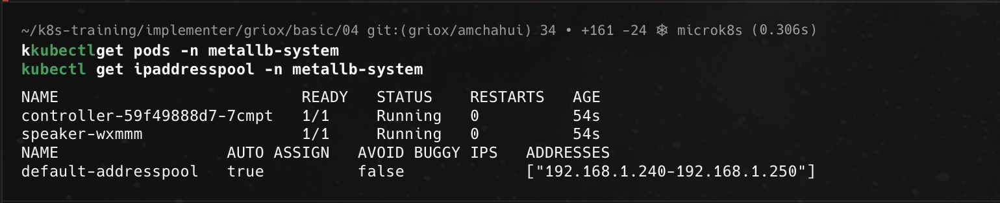
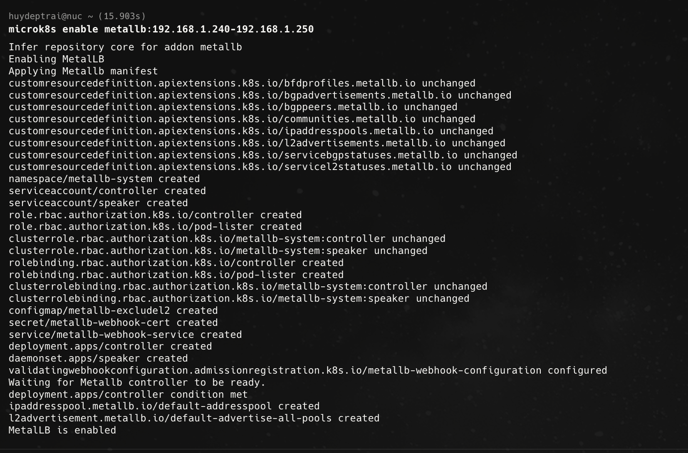

## 2. Tạo namespace và triển khai Deployment

Theo flow bài lab, bước đầu tiên là tạo namespace `basic-04-services` và triển khai ứng dụng `whoami` bằng Deployment với 3 replicas.

Ảnh bằng chứng:

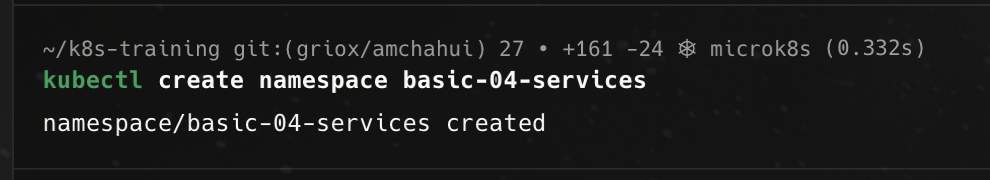
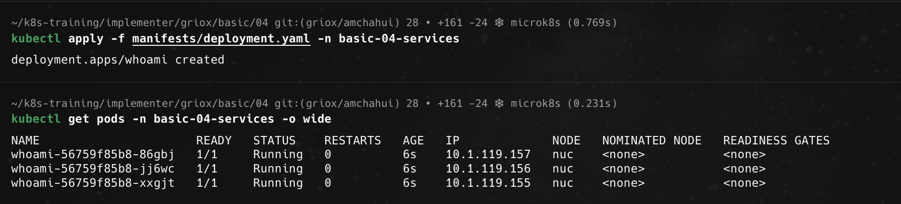

## 3. Tạo ClusterIP Service

Em hoàn thiện thông tin selector và port trong `clusterip-service.yaml` rồi apply để tạo Service kiểu `ClusterIP`. Đây là loại Service mặc định, cho phép giao tiếp nội bộ giữa các tài nguyên trong cluster.

Ảnh bằng chứng:

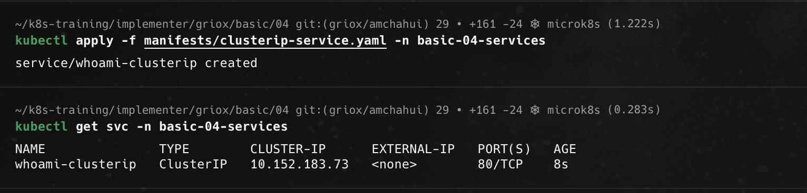

## 4. Kiểm tra service discovery và load balancing nội bộ

Sau khi Service `ClusterIP` sẵn sàng, em tạo một Pod tạm `curler` trong cùng namespace để thực hiện nhiều lệnh request liên tục tới `whoami-clusterip`. Phản hồi trả về các `Hostname:` khác nhau từ 3 Pod backend, chứng minh cơ chế tự động cân bằng tải (load balancing) nội bộ.

Ảnh bằng chứng:

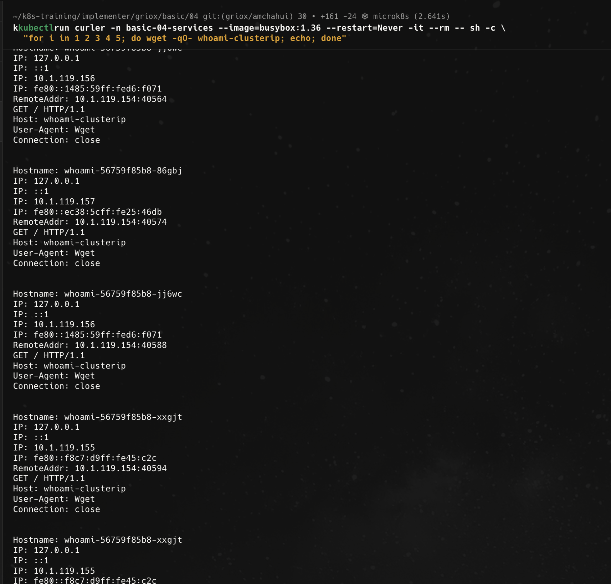

## 5. Tạo NodePort Service

Tiếp theo, em cấu hình file `nodeport-service.yaml` để tạo Service loại `NodePort`. Sau khi apply, Service `whoami-nodeport` mở thêm một cổng cố định trên node (ví dụ `30080`) để phục vụ truy cập từ bên ngoài.

Ảnh bằng chứng:

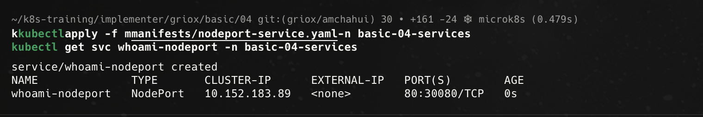

## 6. Truy cập ứng dụng từ bên ngoài qua NodePort

Em lấy địa chỉ `InternalIP` của node (`NODE_IP`) và gửi request thông qua `curl http://$NODE_IP:30080`. Kết quả phản hồi thay đổi `Hostname:` giữa các Pod backend qua mỗi lần gọi, xác nhận ứng dụng đã truy cập thành công từ ngoài cluster.

Ảnh bằng chứng:

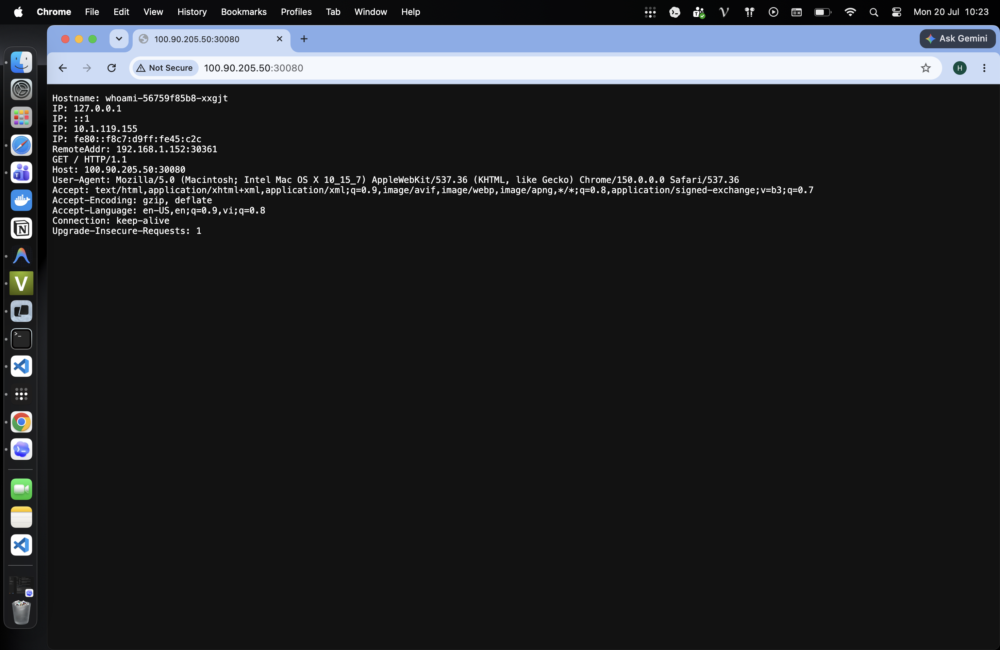

## 7. Tạo LoadBalancer Service (MetalLB)

Cuối cùng, em cấu hình file `loadbalancer-service.yaml` với `type: LoadBalancer` và apply vào cluster. Nhờ MetalLB đang hoạt động, Service `whoami-loadbalancer` nhận ngay một địa chỉ `EXTERNAL-IP` thực tế thay vì giữ trạng thái `<pending>`.

Ảnh bằng chứng:

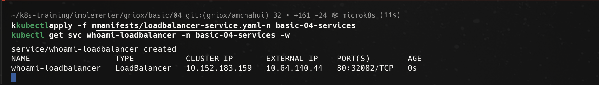

## 8. Bonus Challenge - Kiểm tra Endpoints và cập nhật khi Pod thay đổi

Ở phần bonus challenge, em kiểm tra tài nguyên `endpoints` của Service `whoami-clusterip` và đối chiếu với IP thực tế của các Pod:
- **Trước khi xóa Pod**: Danh sách IP backend trong `endpoints` hoàn toàn khớp với danh sách IP của 3 Pod `whoami`.
- **Sau khi xóa Pod**: Khi xóa 1 Pod bất kỳ, Kubernetes lập tức cập nhật `endpoints`, xóa IP của Pod cũ và tự động thêm IP của Pod mới được ReplicaSet tạo lại.

Ảnh bằng chứng:

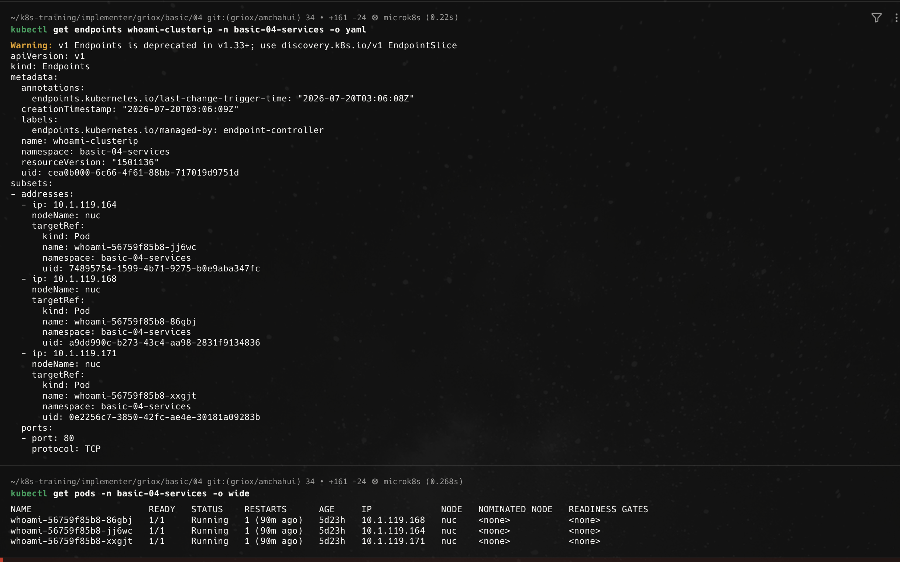
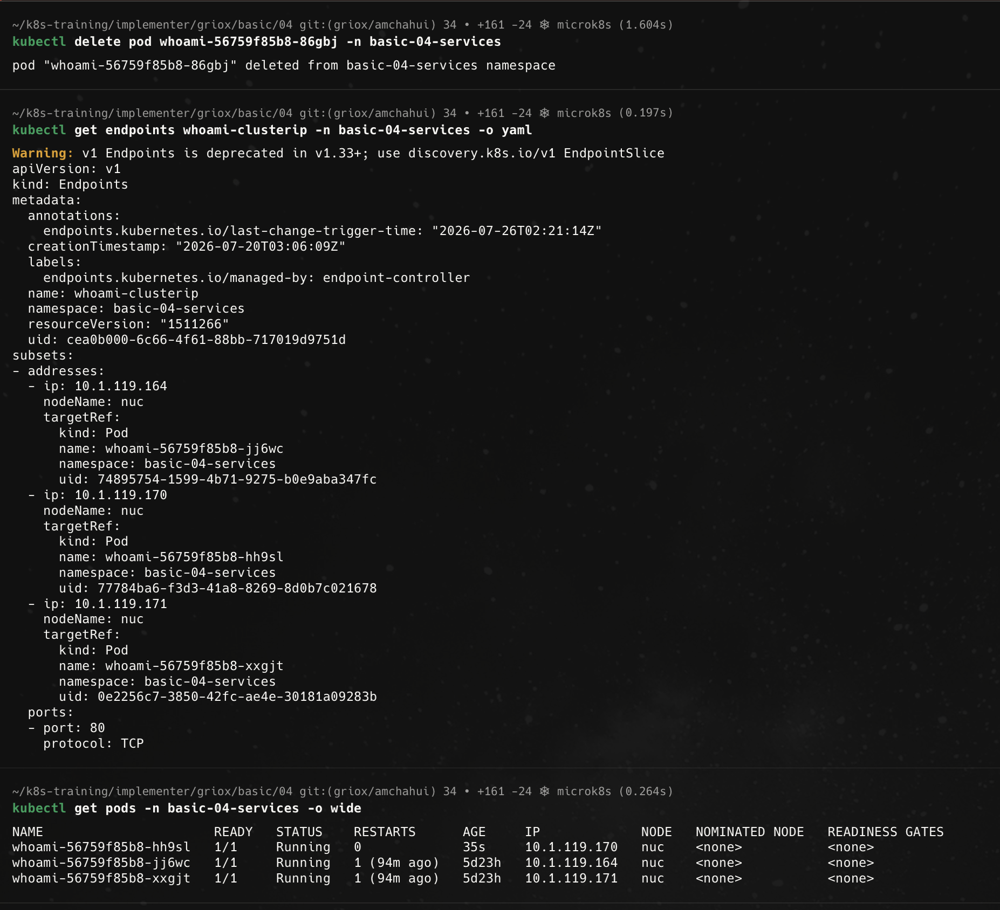

## Tổng kết

Qua bài thực hành này, em đã làm chủ các dạng Service nền tảng của Kubernetes:

- Sử dụng `ClusterIP` cho giao tiếp nội bộ trong cluster.
- Kiểm tra tính năng load balancing qua nhiều Pod backend.
- Sử dụng `NodePort` để mở ứng dụng ra bên ngoài qua cổng của Node.
- Sử dụng `LoadBalancer` kết hợp với MetalLB để cấp địa chỉ `EXTERNAL-IP` trực tiếp trên bare-metal cluster.
- Quan sát và chứng minh sự liên kết tự động giữa `endpoints` và vòng đời các Pod backend.
