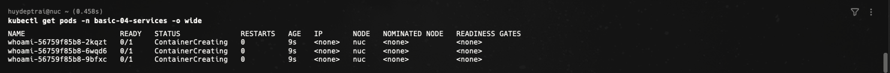
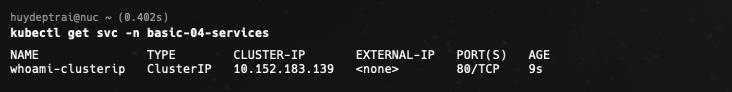
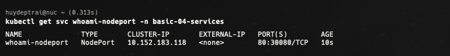
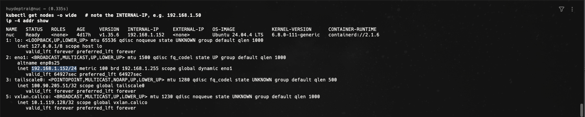
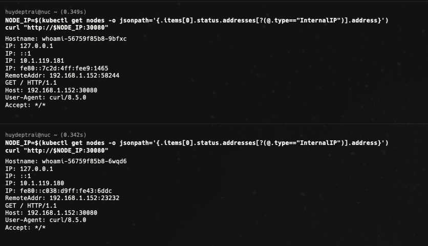
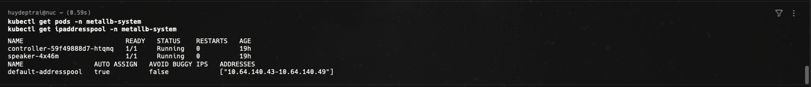
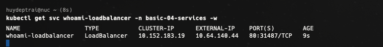
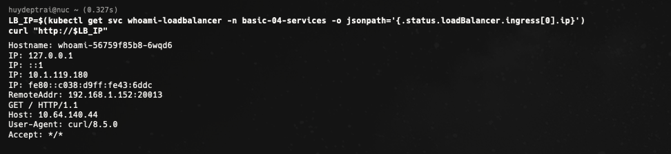
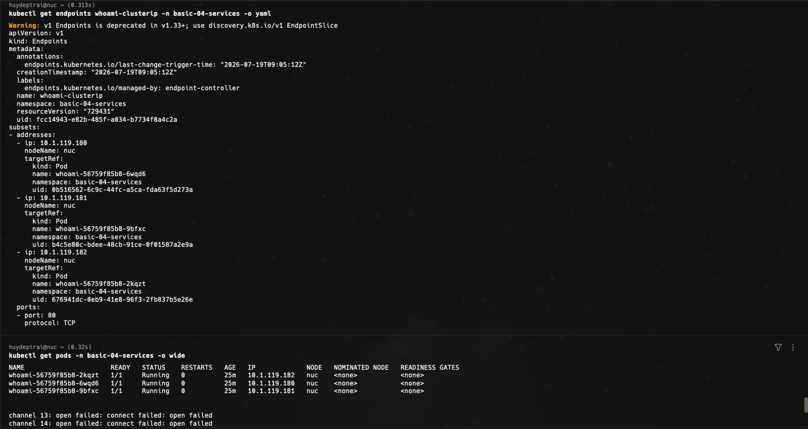
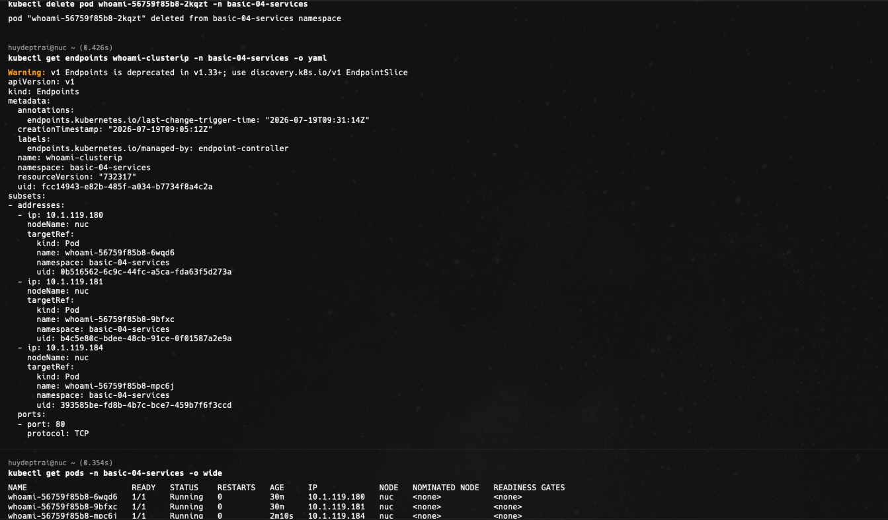

# Bài 04 - Services

Tài liệu này ghi lại quá trình thực hiện bài [basic/04-services/README.md](/Users/huyngo/k8s-training/basic/04-services/README.md) theo đúng flow của bài lab. Môi trường thực hành là máy local chứa source code và SSH vào máy `microk8s` để chạy các lệnh Kubernetes.

## 1. Tạo namespace và triển khai Deployment whoami

Theo flow của bài lab, bước đầu tiên là tạo namespace `basic-04-services` và apply `deployment.yaml` để triển khai ứng dụng `whoami`. Bộ ảnh hiện tại không có ảnh riêng cho lệnh tạo namespace và apply deployment, nhưng ảnh kiểm tra Pod đã xác nhận workload `whoami` đã được tạo thành công trong namespace này.

Lệnh sử dụng:

```bash
ssh huydeptrai@nuc.tail66abd2.ts.net "microk8s kubectl create namespace basic-04-services"
cat basic/04-services/manifests/deployment.yaml | ssh huydeptrai@nuc.tail66abd2.ts.net "microk8s kubectl apply -f - -n basic-04-services"
ssh huydeptrai@nuc.tail66abd2.ts.net "microk8s kubectl get pods -n basic-04-services -o wide"
```

Ảnh bằng chứng:



## 2. Tạo ClusterIP Service

Ở bước này, em chỉnh file `clusterip-service.yaml` rồi apply để tạo Service kiểu `ClusterIP`. Đây là kiểu Service mặc định, chỉ truy cập được từ bên trong cluster. Kết quả sau khi apply cho thấy Service `whoami-clusterip` đã có `CLUSTER-IP` riêng trong mạng nội bộ của Kubernetes.

Lệnh sử dụng:

```bash
cat basic/04-services/manifests/clusterip-service.yaml | ssh huydeptrai@nuc.tail66abd2.ts.net "microk8s kubectl apply -f - -n basic-04-services"
ssh huydeptrai@nuc.tail66abd2.ts.net "microk8s kubectl get svc -n basic-04-services"
```

Ảnh bằng chứng:



## 3. Kiểm tra service discovery và load balancing nội bộ

Sau khi Service `ClusterIP` được tạo, em chạy một Pod tạm `curler` trong cùng namespace để gửi nhiều request tới `whoami-clusterip`. Kết quả trả về các giá trị `Hostname:` khác nhau, chứng minh Service đang phân phối request qua nhiều Pod backend khác nhau. Đây là cơ chế load balancing nội bộ rất cơ bản nhưng quan trọng của Kubernetes Service.

Lệnh sử dụng:

```bash
ssh huydeptrai@nuc.tail66abd2.ts.net "microk8s kubectl run curler -n basic-04-services --image=busybox:1.36 --restart=Never -it --rm -- sh -c 'for i in 1 2 3 4 5; do wget -qO- whoami-clusterip; echo; done'"
```

Ảnh bằng chứng:


## 4. Tạo NodePort Service

Tiếp theo, em chỉnh `nodeport-service.yaml` để tạo Service kiểu `NodePort`. Sau khi apply, Service `whoami-nodeport` được mở thêm cổng `30080` trên node, cho phép truy cập từ bên ngoài cluster qua địa chỉ `NodeIP:30080`.

Lệnh sử dụng:

```bash
cat basic/04-services/manifests/nodeport-service.yaml | ssh huydeptrai@nuc.tail66abd2.ts.net "microk8s kubectl apply -f - -n basic-04-services"
ssh huydeptrai@nuc.tail66abd2.ts.net "microk8s kubectl get svc whoami-nodeport -n basic-04-services"
```

Ảnh bằng chứng:



## 5. Xác định IP nội bộ của node và subnet mạng

Để test `NodePort` và chuẩn bị cho `LoadBalancer`, em kiểm tra `INTERNAL-IP` của node và subnet mà node đang dùng. Ảnh chụp cho thấy node đang có địa chỉ `192.168.1.152` với subnet `/24`, đây là thông tin quan trọng khi cần hiểu đường đi truy cập từ bên ngoài cluster và khi cấu hình dải IP cho MetalLB.

Lệnh sử dụng:

```bash
ssh huydeptrai@nuc.tail66abd2.ts.net "microk8s kubectl get nodes -o wide"
ssh huydeptrai@nuc.tail66abd2.ts.net "ip -4 addr show"
```

Ảnh bằng chứng:



## 6. Truy cập ứng dụng qua NodePort từ bên ngoài cluster

Sau khi có `NodePort`, em lấy `InternalIP` của node rồi dùng `curl` tới `http://<NODE_IP>:30080`. Khi chạy nhiều lần, kết quả trả về các `Hostname:` khác nhau, chứng minh request từ bên ngoài cluster cũng đang được Service phân phối tới nhiều Pod backend.

Lệnh sử dụng:

```bash
ssh huydeptrai@nuc.tail66abd2.ts.net "NODE_IP=\$(microk8s kubectl get nodes -o jsonpath='{.items[0].status.addresses[?(@.type==\"InternalIP\")].address}'); curl \"http://\$NODE_IP:30080\""
```

Ảnh bằng chứng:



## 7. Bật MetalLB

Để sử dụng Service kiểu `LoadBalancer` trên môi trường MicroK8s bare-metal, em cần bật addon `metallb`. Sau khi bật, em kiểm tra `pods` trong namespace `metallb-system` và `ipaddresspool` để xác nhận MetalLB đang chạy và đã có pool IP sẵn sàng cấp phát.

Lệnh sử dụng:

```bash
ssh huydeptrai@nuc.tail66abd2.ts.net "microk8s kubectl get pods -n metallb-system"
ssh huydeptrai@nuc.tail66abd2.ts.net "microk8s kubectl get ipaddresspool -n metallb-system"
```

Ảnh bằng chứng:



## 8. Tạo LoadBalancer Service

Ở bước này, em chỉnh `loadbalancer-service.yaml` rồi apply để tạo Service kiểu `LoadBalancer`. Sau khi apply, MetalLB cấp gần như ngay lập tức một `EXTERNAL-IP` thật từ pool của nó. Điều này khác với môi trường không có load balancer, nơi `EXTERNAL-IP` thường sẽ ở trạng thái `<pending>`.

Lệnh sử dụng:

```bash
cat basic/04-services/manifests/loadbalancer-service.yaml | ssh huydeptrai@nuc.tail66abd2.ts.net "microk8s kubectl apply -f - -n basic-04-services"
ssh huydeptrai@nuc.tail66abd2.ts.net "microk8s kubectl get svc whoami-loadbalancer -n basic-04-services -w"
```

Ảnh bằng chứng:



## 9. Truy cập ứng dụng qua LoadBalancer IP

Sau khi Service `LoadBalancer` được cấp IP, em lấy `EXTERNAL-IP` bằng `jsonpath` rồi dùng `curl` tới địa chỉ đó. Kết quả trả về nội dung của `whoami`, chứng minh Service đã thực sự được publish ra ngoài thông qua MetalLB.

Lệnh sử dụng:

```bash
ssh huydeptrai@nuc.tail66abd2.ts.net "LB_IP=\$(microk8s kubectl get svc whoami-loadbalancer -n basic-04-services -o jsonpath='{.status.loadBalancer.ingress[0].ip}'); curl \"http://\$LB_IP\""
```

Ảnh bằng chứng:



## 10. Bonus Challenge - So sánh Endpoints với Pod IP

Ở phần bonus challenge đầu tiên, em chạy `kubectl get endpoints whoami-clusterip -o yaml` rồi so sánh danh sách IP backend với `kubectl get pods -o wide`. Kết quả cho thấy các IP trong `endpoints` trùng với IP thật của các Pod `whoami`. Điều này giúp em hiểu rằng Service không route theo tên Pod cứng, mà route theo danh sách endpoint động do controller quản lý.

Lệnh sử dụng:

```bash
ssh huydeptrai@nuc.tail66abd2.ts.net "microk8s kubectl get endpoints whoami-clusterip -n basic-04-services -o yaml"
ssh huydeptrai@nuc.tail66abd2.ts.net "microk8s kubectl get pods -n basic-04-services -o wide"
```

Ảnh bằng chứng:



## 11. Bonus Challenge - Xóa một Pod và kiểm tra endpoint cập nhật

Tiếp theo, em xóa một Pod `whoami` rồi kiểm tra lại `endpoints` và `pods`. Kết quả cho thấy IP của Pod cũ biến mất khỏi danh sách backend, sau đó Pod mới được tạo lại với IP mới và nhanh chóng xuất hiện trong `endpoints`. Đây là minh chứng rất rõ cho việc Service tự động cập nhật backend list khi Pod thay đổi.

Lệnh sử dụng:

```bash
ssh huydeptrai@nuc.tail66abd2.ts.net "microk8s kubectl delete pod whoami-56759f85b8-2kqzt -n basic-04-services"
ssh huydeptrai@nuc.tail66abd2.ts.net "microk8s kubectl get endpoints whoami-clusterip -n basic-04-services -o yaml"
ssh huydeptrai@nuc.tail66abd2.ts.net "microk8s kubectl get pods -n basic-04-services -o wide"
```

Ảnh bằng chứng:



## Tổng kết

Qua bài này, em đã thực hành được các khái niệm rất quan trọng của Kubernetes Service:

- Dùng `ClusterIP` để expose ứng dụng trong nội bộ cluster.
- Dùng `NodePort` để mở ứng dụng ra ngoài qua `NodeIP:port`.
- Dùng `LoadBalancer` kết hợp với MetalLB để có `EXTERNAL-IP` thật.
- Quan sát Service load balancing qua nhiều Pod backend.
- Kiểm tra mối liên hệ giữa `endpoints` và Pod IP thật.
- Xác nhận backend list của Service cập nhật rất nhanh khi Pod bị xóa và được tạo lại.

Đây là nền tảng rất quan trọng trước khi học tiếp về Ingress, reverse proxy và cách publish ứng dụng Kubernetes ra ngoài một cách hoàn chỉnh hơn.
