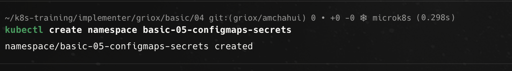
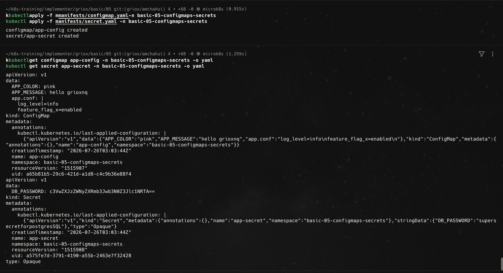
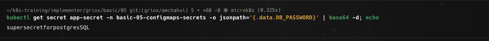
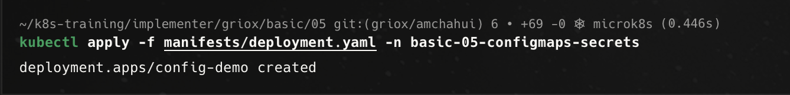
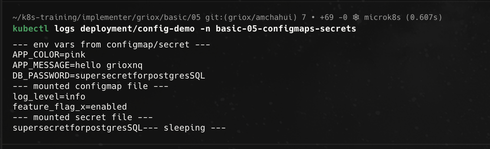
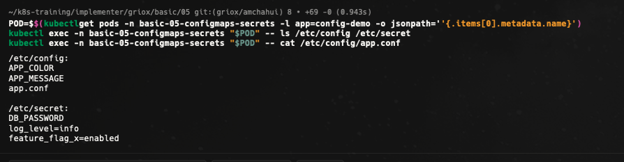
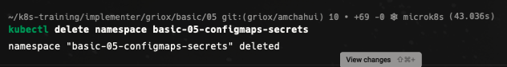
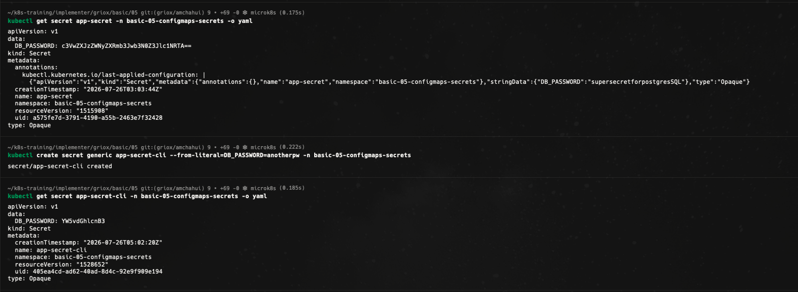

# Bài 05 - ConfigMaps & Secrets

Tài liệu này ghi lại quá trình thực hiện bài [basic/05-configmaps-secrets/README.md](/Users/huyngo/k8s-training/basic/05-configmaps-secrets/README.md) theo đúng flow của bài lab. Môi trường thực hành là máy local chứa source code và SSH vào máy `microk8s` để chạy các lệnh Kubernetes.

## 1. Tạo namespace

Bước đầu tiên em tạo namespace `basic-05-configmaps-secrets` để cô lập các tài nguyên của bài thực hành.

Ảnh bằng chứng:

## 2. Tạo ConfigMap và Secret, kiểm tra giải mã Secret

Em hoàn thiện các file `manifests/configmap.yaml` và `manifests/secret.yaml`, sau đó apply vào cluster. Tiếp theo em dùng lệnh `kubectl get` xuất định dạng YAML để kiểm tra dữ liệu của ConfigMap và Secret, đồng thời giải mã thủ công giá trị base64 của `DB_PASSWORD`.

Ảnh bằng chứng:

## 3. Tạo Deployment sử dụng ConfigMap và Secret

Sau khi đã tạo ConfigMap và Secret, em cập nhật `manifests/deployment.yaml` để gắn cấu hình vào Deployment thông qua biến môi trường (environment variables) và mount thành các file trong volume.

Ảnh bằng chứng:

## 4. Xác nhận cấu hình qua log của Deployment

Em kiểm tra log của Deployment `config-demo` để xác nhận container đã nhận đúng các biến môi trường (`APP_COLOR`, `APP_MESSAGE`, `DB_PASSWORD`) cũng như nội dung của các file cấu hình được mount.

Ảnh bằng chứng:

## 5. Kiểm tra trực tiếp các file cấu hình được mount vào Pod

Để xác nhận thêm, em thực hiện lệnh `exec` truy cập vào Pod đang chạy để liệt kê các file trong thư mục `/etc/config`, `/etc/secret` và đọc nội dung file `app.conf`.

Ảnh bằng chứng:

## 6. Dọn dẹp tài nguyên

Sau khi hoàn thành các bước kiểm tra chính, em xóa namespace `basic-05-configmaps-secrets` để giải phóng tài nguyên trên cluster.

Ảnh bằng chứng:

## 7. Bonus Challenge - Tạo Secret bằng lệnh imperative và so sánh

Ở phần bonus challenge, em tạo một Secret mới `app-secret-cli` bằng lệnh `kubectl create secret generic` kiểu imperative (truyền `--from-literal`), sau đó xuất định dạng `-o yaml` để so sánh với Secret được tạo bằng file manifest declarative trước đó.

Ảnh bằng chứng:

## Tổng kết

Qua bài thực hành này, em đã nắm vững các kiến thức quan trọng về quản lý cấu hình và dữ liệu nhạy cảm trong Kubernetes:

- Phân biệt công dụng của **ConfigMap** (cấu hình thông thường) và **Secret** (dữ liệu nhạy cảm được mã hóa base64).
- Cách tiêu thụ ConfigMap và Secret theo 2 dạng: biến môi trường (environment variables) và file mount qua Volume.
- Thực hành kiểm tra giá trị qua `kubectl logs` và trực tiếp bên trong Pod bằng `kubectl exec`.
- Phân biệt cách tạo Secret theo dạng declarative (YAML) và imperative (CLI `--from-literal`).
