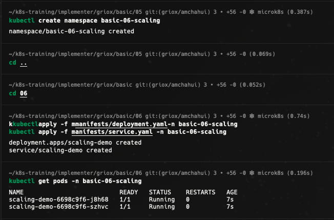
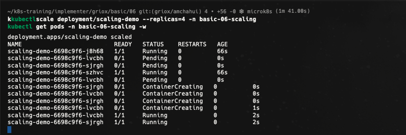
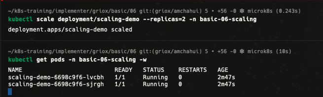
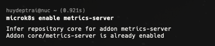
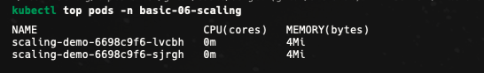
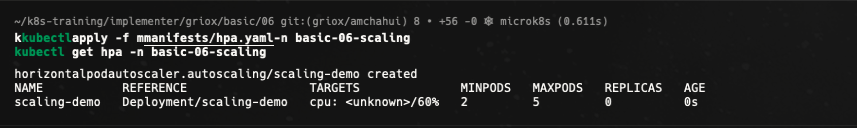
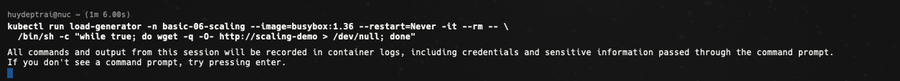
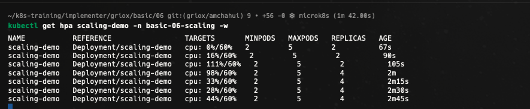
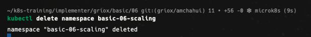

# Bài 06 - Scaling

Tài liệu này ghi lại quá trình thực hiện bài [basic/06-scaling/README.md](/Users/huyngo/k8s-training/basic/06-scaling/README.md) theo đúng flow của bài lab. Môi trường thực hành là máy local chứa source code và SSH vào máy `microk8s` để chạy các lệnh Kubernetes.

## 1. Tạo namespace và triển khai ứng dụng

Bước đầu tiên em tạo namespace `basic-06-scaling`, sau đó apply các file manifest `deployment.yaml` và `service.yaml` để triển khai ứng dụng mẫu `scaling-demo`. Kết quả kiểm tra Pods cho thấy các Pod ban đầu đã khởi tạo thành công và chuyển sang trạng thái `Running`.

Ảnh bằng chứng:

## 2. Thực hành mở rộng thủ công (Manual Scaling)

Em thực hiện điều chỉnh số lượng replica thủ công bằng lệnh `kubectl scale`. Ban đầu em tăng số lượng replica của Deployment lên 4 Pods và quan sát quá trình khởi tạo thêm các Pod mới. Sau khi đạt đủ 4 Pods running, em giảm số lượng replica trở lại 2 Pods để kiểm tra khả năng scale down thủ công.

Ảnh bằng chứng:

## 3. Kích hoạt metrics-server và kiểm tra tài nguyên Pods

Để chuẩn bị cho tính năng tự động mở rộng (Autoscaling) dựa trên tải CPU, em bật addon `metrics-server` trên MicroK8s. Sau khi addon hoạt động, em kiểm tra chỉ số tài nguyên tiêu thụ (CPU/Memory) của từng Pod thông qua lệnh `kubectl top pods`.

Ảnh bằng chứng:

## 4. Tạo HorizontalPodAutoscaler (HPA)

Em cấu hình file `manifests/hpa.yaml` với quy định ngưỡng tiêu thụ CPU cùng giới hạn số lượng Pod tối thiểu và tối đa. Sau khi apply, em kiểm tra đối tượng HPA `scaling-demo` để xác nhận nó đã kết nối với Deployment và bắt đầu theo dõi chỉ số CPU.

Ảnh bằng chứng:

## 5. Tạo tải và quan sát cơ chế tự động mở rộng (Autoscaling)

Để kiểm tra HPA, em chạy một Pod tạm `load-generator` liên tục gửi các request tới Service để đẩy mức tiêu thụ CPU của các Pods lên cao. Trong lúc tạo tải, em theo dõi trạng thái của HPA và Pods; kết quả ghi nhận chỉ số CPU vượt ngưỡng target và HPA tự động tăng số lượng Pods để đáp ứng nhu cầu xử lý.

Ảnh bằng chứng:

## 6. Dọn dẹp tài nguyên

Sau khi hoàn thành các thử nghiệm scaling thủ công và tự động, em tiến hành xóa namespace `basic-06-scaling` để giải phóng toàn bộ tài nguyên trên cluster.

Ảnh bằng chứng:

## Tổng kết

Qua bài thực hành này, em đã làm chủ các phương pháp mở rộng ứng dụng trong Kubernetes:

- Thực hiện **Manual Scaling** bằng lệnh `kubectl scale` để điều chỉnh trực tiếp số lượng replicas lên và xuống.
- Kích hoạt addon `metrics-server` và sử dụng `kubectl top` để giám sát chỉ số tiêu thụ tài nguyên của Pod.
- Khai báo và sử dụng **HorizontalPodAutoscaler (HPA)** để tự động điều chỉnh số lượng Pod dựa trên mức sử dụng CPU thực tế dưới tải lớn.
- Quan sát chu trình tự động tăng (scale up) và hạ (scale down) số lượng Pods theo thời gian thực.
