# Bài 07 - Logs & Debugging

Tài liệu này ghi lại quá trình thực hiện bài [basic/07-logs-and-debugging/README.md](/Users/huyngo/k8s-training/basic/07-logs-and-debugging/README.md) theo đúng flow của bài lab. Môi trường thực hành là máy local chứa source code và SSH vào máy `microk8s` để chạy các lệnh Kubernetes.

## 1. Tạo namespace

Bước đầu tiên em tạo namespace `basic-07-logs-and-debugging` để cô lập các tài nguyên và tiến hành thực hành các kỹ năng chẩn đoán sự cố.

Ảnh bằng chứng:

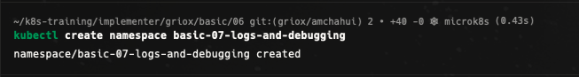

## 2. Kiểm tra log của Pod nhiều container (Multi-container logs)

Em tiến hành triển khai Pod `multi-log-pod` chứa 2 container (`app` và `sidecar`). Do Pod có nhiều container, khi truy vết log em sử dụng tham số `-c` để chỉ định container cụ thể, tham số `-f` để theo dõi log trực tiếp, tham số `--all-containers=true` để xem log đồng thời từ tất cả container, cũng như các tham số `--tail` và `--since` để lọc log theo số dòng hoặc thời gian.

Ảnh bằng chứng:

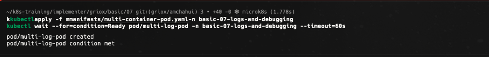
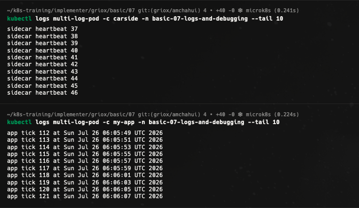
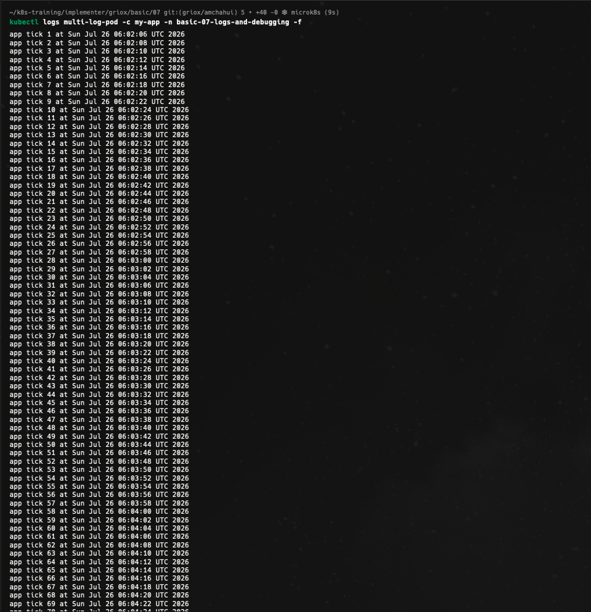
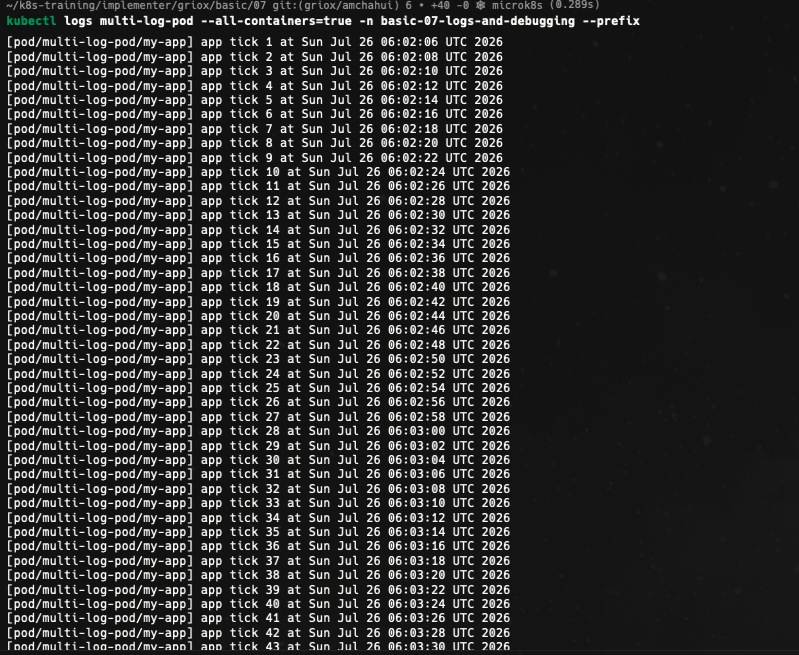
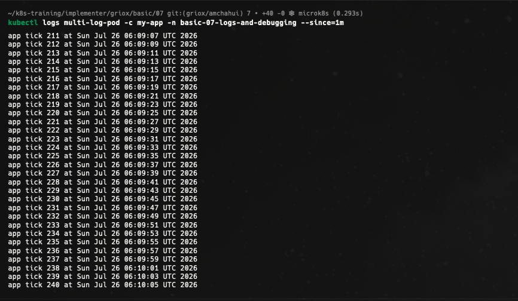

## 3. Thực thi lệnh trong Pod và quan sát sự kiện bằng describe

Em sử dụng lệnh `kubectl exec` để truy cập trực tiếp vào shell bên trong container `app` và kiểm tra các tiến trình đang chạy (`ps aux`). Sau đó, em dùng lệnh `kubectl describe` để kiểm tra thông tin chi tiết của Pod, đặc biệt là phần `Events` ở cuối để truy vết các sự kiện khởi tạo, kéo image hay lập lịch của Kubernetes.

Ảnh bằng chứng:

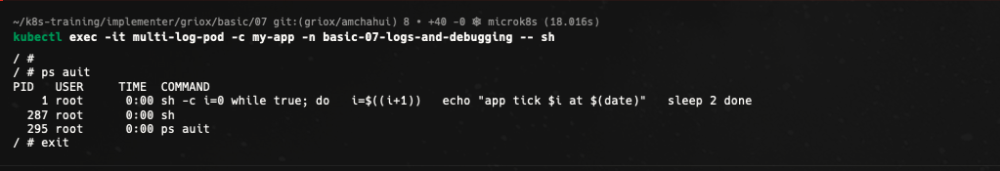
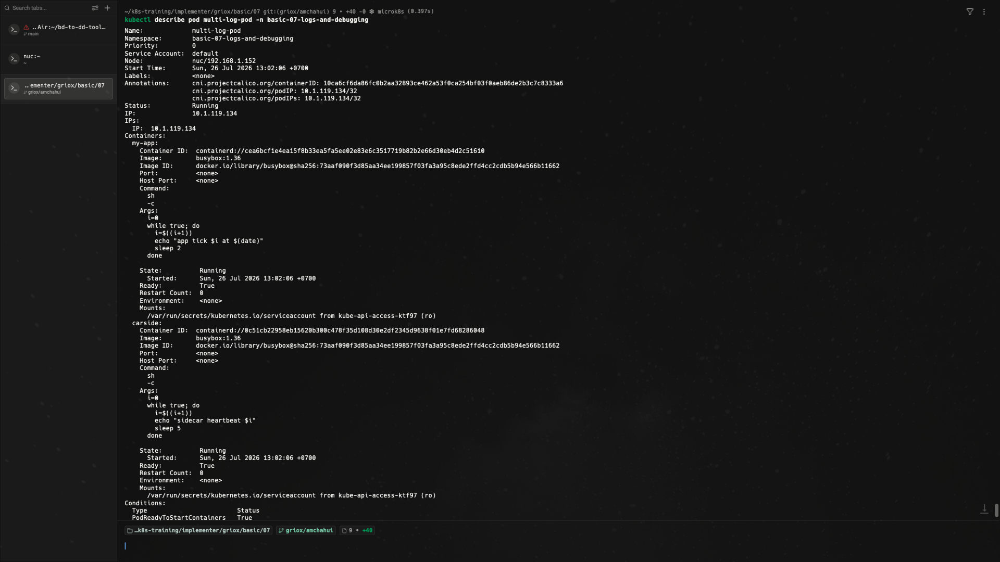

## 4. Chẩn đoán và xử lý sự cố Pod bị CrashLoopBackOff

Em triển khai Pod `crashloop-pod` bị lỗi cố ý để thực hành chẩn đoán Pod liên tục bị ngắt kết nối và khởi động lại. Thông qua quan sát trạng thái, số lần `RESTARTS` tăng dần và status chuyển thành `CrashLoopBackOff`. Để tìm nguyên nhân gốc rễ, em kết hợp `kubectl describe pod` để xem `Exit Code` và lệnh `kubectl logs` kèm tham số `--previous` để đọc lại log của lần chạy bị crash ngay trước đó.

Ảnh bằng chứng:

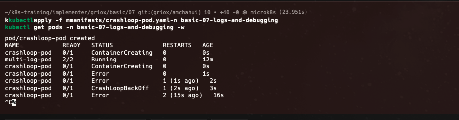
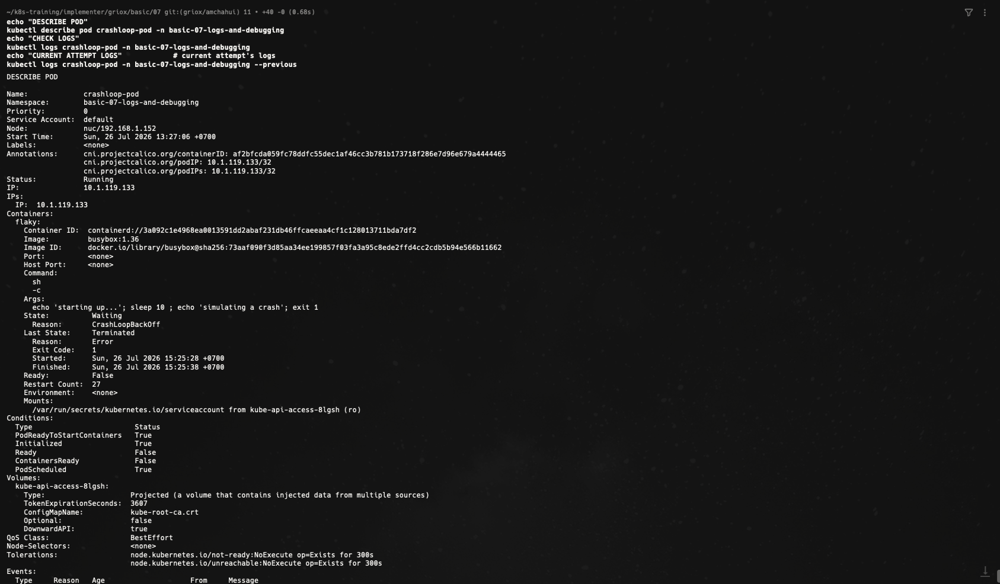
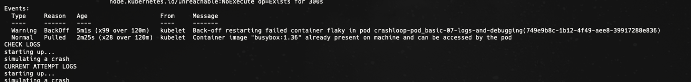

## 5. Xem các sự kiện trên toàn bộ namespace (Cluster-wide events)

Em thực hiện truy vấn danh sách tất cả các sự kiện diễn ra trong namespace bằng `kubectl get events` và sắp xếp theo mốc thời gian gần nhất (`--sort-by='.lastTimestamp'`). Điều này giúp nắm bắt toàn bộ lịch sử các cảnh báo và hoạt động của cluster trong quá trình vận hành.

Ảnh bằng chứng:

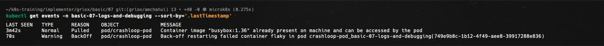

## 6. Dọn dẹp tài nguyên

Sau khi hoàn thành các bài tập chẩn đoán cơ bản, em tiến hành xóa namespace `basic-07-logs-and-debugging` để dọn dẹp tài nguyên.

Ảnh bằng chứng:

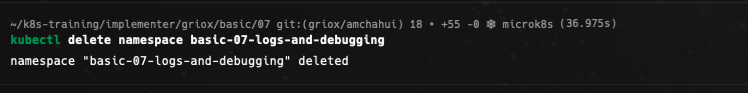

## 7. Bonus Challenge - Chẩn đoán sự cố LivenessProbe thất bại

Ở phần bonus challenge, em thêm cấu hình `livenessProbe` cố tình chỉ định sai cổng kiểm tra HTTP GET vào `crashloop-pod.yaml`. Sau khi apply bản ghi mới, tiến trình bên trong Pod vẫn chạy bình thường nhưng `livenessProbe` liên tục thất bại khiến Kubelet tự động ngắt và restart container. Em sử dụng `kubectl describe` để kiểm tra chi tiết các sự kiện cảnh báo `Liveness probe failed` từ Kubelet.

Ảnh bằng chứng:

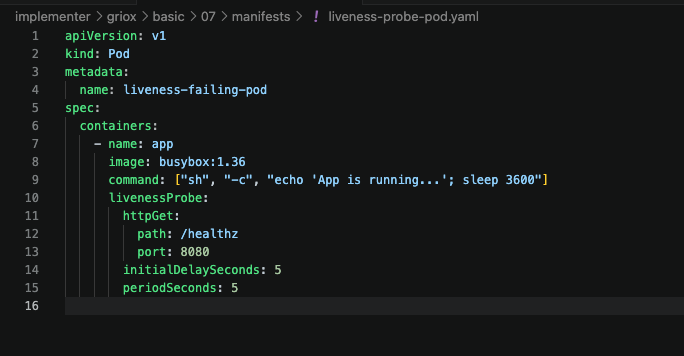
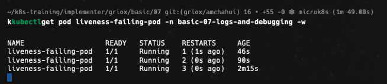
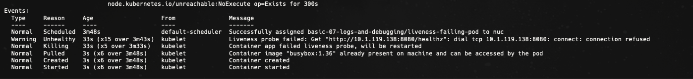

## Tổng kết

Qua bài thực hành này, em đã thành thạo bộ công cụ chẩn đoán và khắc phục sự cố (debugging toolkit) nền tảng trong Kubernetes:

- Truy vết log linh hoạt đối với Pod nhiều container bằng các tùy chọn `-c`, `-f`, `--all-containers`, `--tail`, `--since`.
- Truy cập vào shell của container bằng `kubectl exec` để kiểm tra trạng thái bên trong.
- Phân tích thông tin chi tiết và phần `Events` của Pod bằng `kubectl describe`.
- Chẩn đoán nguyên nhân Pod rơi vào trạng thái `CrashLoopBackOff` bằng `kubectl logs --previous`.
- Theo dõi danh sách sự kiện chung của namespace bằng `kubectl get events`.
- Khai báo và phân biệt lỗi restart do tiến trình chết (Process exit) với lỗi restart do `livenessProbe` thất bại.
