# Bài 08 - Updates & Rollbacks

Tài liệu này ghi lại quá trình thực hiện bài [basic/08-updates-and-rollbacks/README.md](/Users/huyngo/k8s-training/basic/08-updates-and-rollbacks/README.md) theo đúng flow của bài lab. Môi trường thực hành là máy local chứa source code và SSH vào máy `microk8s` để chạy các lệnh Kubernetes.

## 1. Tạo namespace và triển khai phiên bản v1

Bước đầu tiên em tạo namespace `basic-08-updates-and-rollbacks` và áp dụng file manifest `deployment.yaml` với image ban đầu `nginx:1.25-alpine`. Tiến trình `rollout status` xác nhận việc triển khai phiên bản đầu tiên đã thành công.

Ảnh bằng chứng:

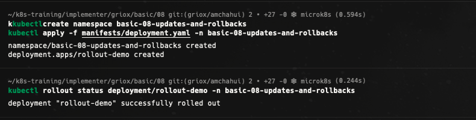

## 2. Thực hiện cập nhật phiên bản (Rollout Update)

Em cập nhật image của Deployment lên phiên bản `nginx:1.27-alpine` bằng lệnh `kubectl set image` và thêm chú thích nguyên nhân thay đổi (`change-cause`). Sau khi cập nhật, em dùng `jsonpath` để xác nhận container đã chuyển sang image mới thành công.

Ảnh bằng chứng:

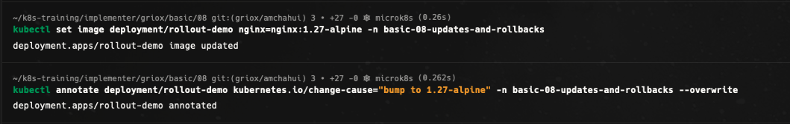
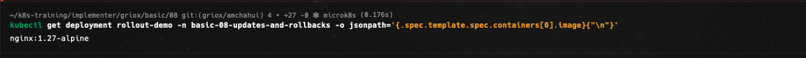

## 3. Kiểm tra lịch sử cập nhật (Revision History)

Em sử dụng lệnh `kubectl rollout history` để kiểm tra lịch sử các phiên bản revision của Deployment. Kết quả hiển thị danh sách các revision cùng thông điệp chú thích `change-cause` tương ứng, cho phép truy vết chi tiết nội dung thay đổi của từng phiên bản.

Ảnh bằng chứng:

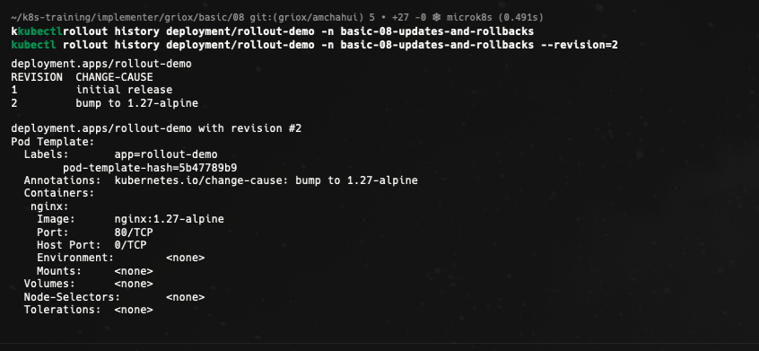

## 4. Cố tình triển khai một image bị lỗi

Em thực hiện cập nhật sang một image không tồn tại (`nginx:this-tag-does-not-exist`) để quan sát cơ chế bảo vệ của Kubernetes. Quá trình rollout bị treo do lỗi `ImagePullBackOff`. Các Pod cũ vẫn tiếp tục duy trì hoạt động phục vụ ứng dụng nhờ chiến lược `RollingUpdate` với `maxUnavailable`.

Ảnh bằng chứng:

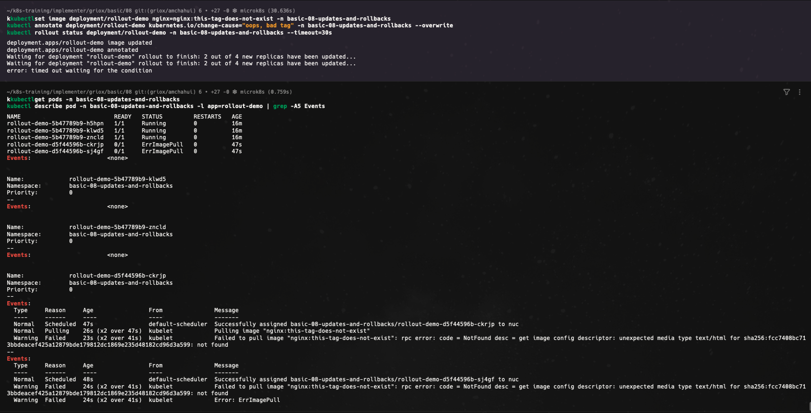

## 5. Thực hiện khôi phục phiên bản (Rollback)

Sau khi phát hiện sự cố với image lỗi, em dùng lệnh `kubectl rollout undo` để hủy bỏ đợt cập nhật và quay về phiên bản ổn định trước đó. Quá trình rollback diễn ra an toàn và trạng thái Deployment được khôi phục về phiên bản hoạt động bình thường.

Ảnh bằng chứng:

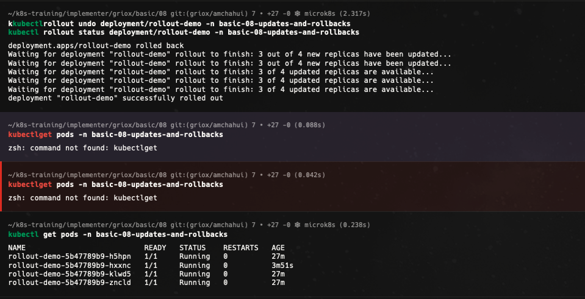

## 6. Tạm dừng và tiếp tục quá trình cập nhật (Pause/Resume Rollout)

Em thực hành tính năng `kubectl rollout pause` để tạm dừng tiến trình rollout, sau đó tiến hành gộp nhiều thay đổi đồng thời (đổi image sang `nginx:1.26-alpine` và thiết lập giới hạn tài nguyên CPU/RAM). Sau khi gộp đủ thay đổi, em chạy `kubectl rollout resume` để Kubernetes áp dụng toàn bộ cấu hình mới trong một lần rollout duy nhất.

Ảnh bằng chứng:

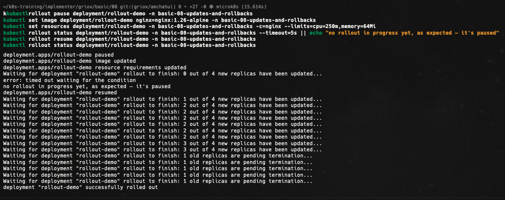

## 7. Bonus Challenge - Cấu hình chiến lược `maxUnavailable: 0` và `maxSurge: 1`

Ở phần bonus challenge, em cập nhật file `deployment.yaml` với chiến lược `RollingUpdate` thiết lập `maxUnavailable: 0` và `maxSurge: 1`. Cấu hình này bắt buộc Kubernetes phải khởi tạo thành công Pod mới trước khi ngắt bất kỳ Pod cũ nào, đảm bảo 100% công suất phục vụ (Zero-downtime tuyệt đối) trong suốt quá trình nâng cấp phiên bản.

Ảnh bằng chứng:

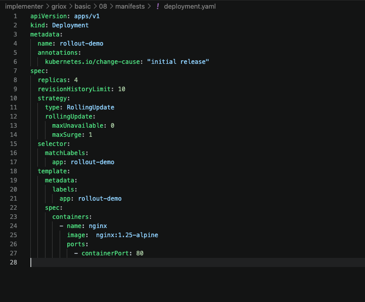
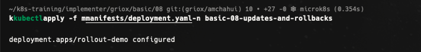
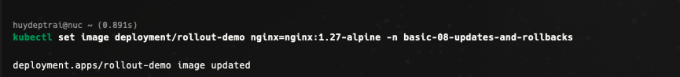
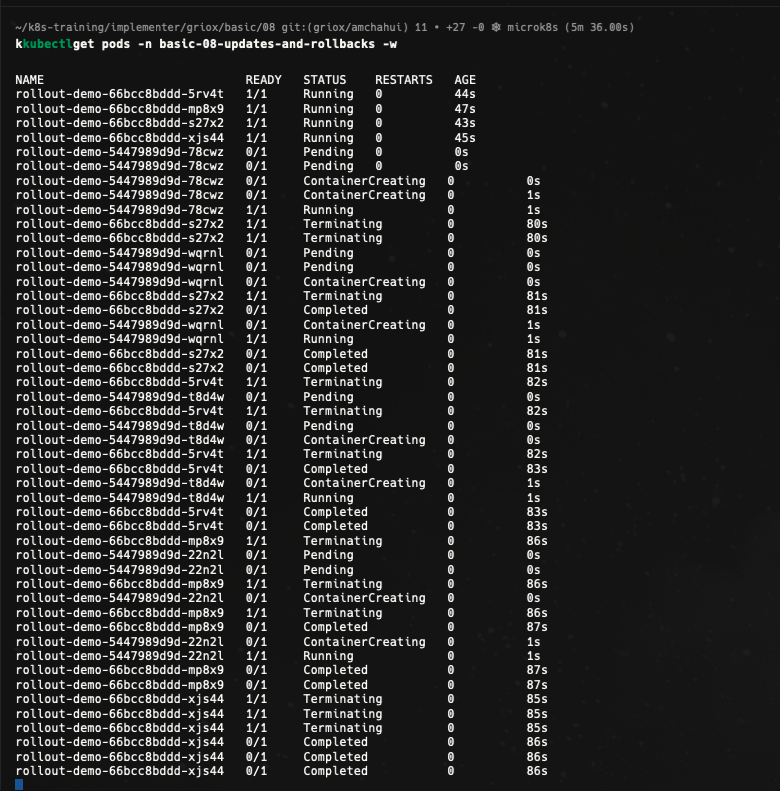

## Tổng kết

Qua bài thực hành này, em đã thành thạo các thao tác quản lý vòng đời ứng dụng với Deployment trong Kubernetes:

- Thực hiện **RollingUpdate** để nâng cấp phiên bản container mượt mà không làm gián đoạn dịch vụ.
- Quản lý và truy vết lịch sử các phiên bản bằng `kubectl rollout history` kết hợp `change-cause`.
- Hiểu và ứng dụng cơ chế an toàn khi gặp sự cố image lỗi (`ErrImagePull` / `ImagePullBackOff`).
- Thực hiện **Rollback** nhanh chóng đưa ứng dụng về phiên bản hoạt động ổn định bằng `kubectl rollout undo`.
- Sử dụng `kubectl rollout pause` và `resume` để gom nhóm nhiều thay đổi cấu hình vào một lượt rollout.
- Tùy chỉnh thông số `maxUnavailable` và `maxSurge` để tối ưu hóa chiến lược cập nhật zero-downtime phù hợp với yêu cầu bài toán.
