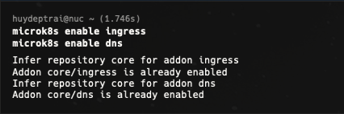
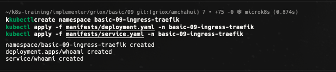
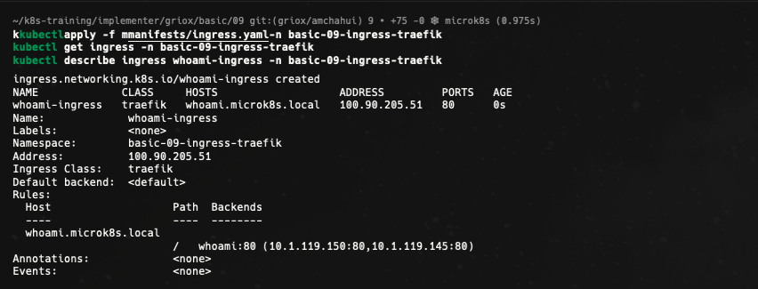
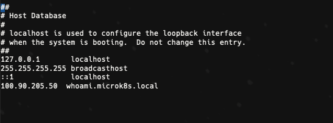
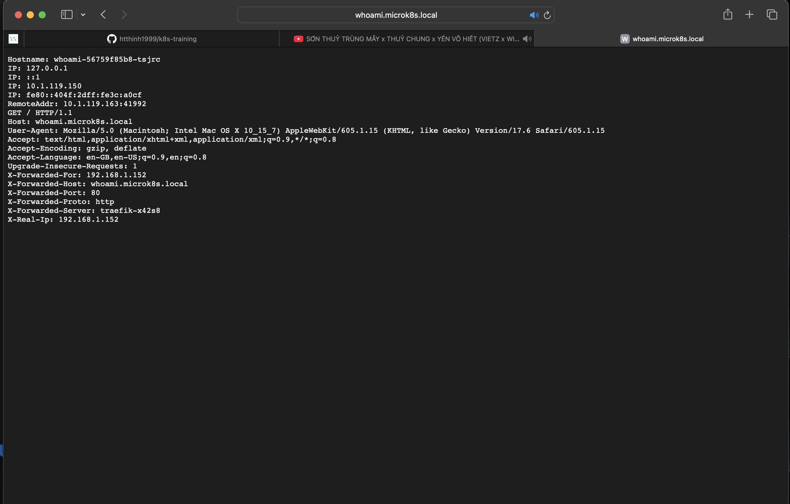
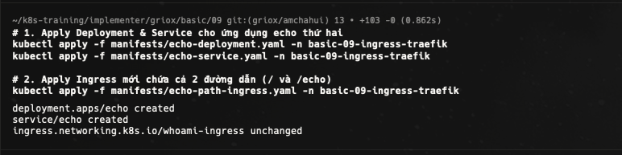
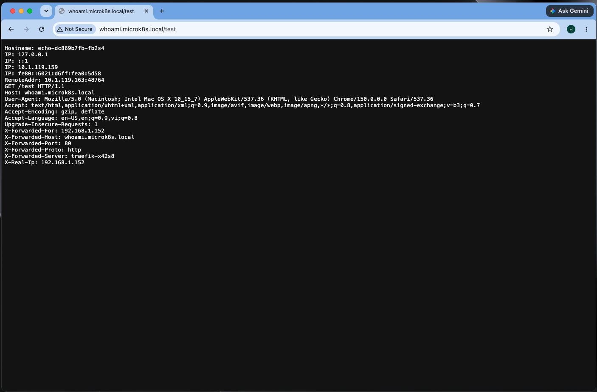
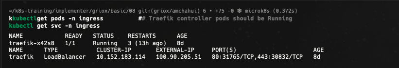

# Bài 09 - Ingress routing with Traefik (local domains)

Tài liệu này ghi lại quá trình thực hiện bài [basic/09-ingress-traefik/README.md](/Users/huyngo/k8s-training/basic/09-ingress-traefik/README.md) theo đúng flow của bài lab. Môi trường thực hành là máy local chứa source code và SSH vào máy `microk8s` để chạy các lệnh Kubernetes.

## 1. Kích hoạt các addon cần thiết (Prerequisites)

Trước khi cấu hình Ingress, em kích hoạt hai addon quan trọng của MicroK8s là `ingress` (sử dụng Traefik Ingress Controller) và `dns`. Việc này đảm bảo hệ thống có bộ điều khiển định tuyến và khả năng phân giải tên miền nội bộ.

Ảnh bằng chứng:

## 2. Tạo namespace và triển khai ứng dụng whoami

Theo flow bài lab, em tạo namespace `basic-09-ingress-traefik` và triển khai ứng dụng `whoami` cùng Service đi kèm để làm backend xử lý request.

Ảnh bằng chứng:

## 3. Khai báo tài nguyên Ingress

Em cấu hình file `manifests/ingress.yaml` chỉ định `ingressClassName: public` và `host: whoami.microk8s.local`, sau đó apply vào cluster để tạo đối tượng Ingress định tuyến lưu lượng truy cập từ ngoài vào Service `whoami`.

Ảnh bằng chứng:

## 4. Cấu hình phân giải tên miền cục bộ (hosts file)

Để máy tính cá nhân nhận diện được tên miền ảo `whoami.microk8s.local`, em cấu hình ánh xạ địa chỉ IP của cluster/node vào tên miền trong file `hosts` của hệ điều hành.

Ảnh bằng chứng:

## 5. Kiểm tra truy cập qua tên miền

Em kiểm tra kết quả bằng cách truy cập tên miền `http://whoami.microk8s.local/` thông qua trình duyệt hoặc `curl`. Kết quả trả về thông tin request từ container `whoami` xác nhận Ingress Controller đã định tuyến thành công.

Ảnh bằng chứng:

## 6. Bonus Challenge - Định tuyến dựa trên đường dẫn (Path-based routing)

Ở phần bonus đầu tiên, em triển khai thêm ứng dụng thứ hai tên là `echo` và cập nhật Ingress bằng file `echo-path-ingress.yaml`. Cấu hình này định tuyến đường dẫn gốc `/` đến dịch vụ `whoami` và đường dẫn `/echo` đến dịch vụ `echo` trên cùng một tên miền `whoami.microk8s.local`.

Ảnh bằng chứng:

## 7. Bonus Challenge - Kiểm tra tổng thể tài nguyên và cấp IP LoadBalancer

Em kiểm tra danh sách Pods, Services và Ingress trong namespace `basic-09-ingress-traefik`. Kết quả xác nhận các backend Pods đều đang ở trạng thái `Running`, các Service hoạt động ổn định và Ingress đã nhận địa chỉ IP phục vụ định tuyến.

Ảnh bằng chứng:

## Tổng kết

Qua bài thực hành này, em đã làm chủ kỹ thuật định tuyến tài nguyên bằng Ingress với Traefik trong Kubernetes:

- Kích hoạt và kiểm tra Traefik Ingress Controller trên MicroK8s.
- Tạo và khai báo đối tượng **Ingress** để ánh xạ tên miền ảo (`whoami.microk8s.local`) tới Service backend.
- Cấu hình file `hosts` cục bộ để thử nghiệm tên miền không qua DNS công cộng.
- Thực hành kỹ thuật **Path-based routing** để phân chia nhiều đường dẫn (`/` và `/echo`) tới các dịch vụ backend khác nhau trên cùng một host.
- Hiểu cơ chế hoạt động của `IngressClass` và cách Ingress tiếp nhận traffic từ ngoài vào cluster.
